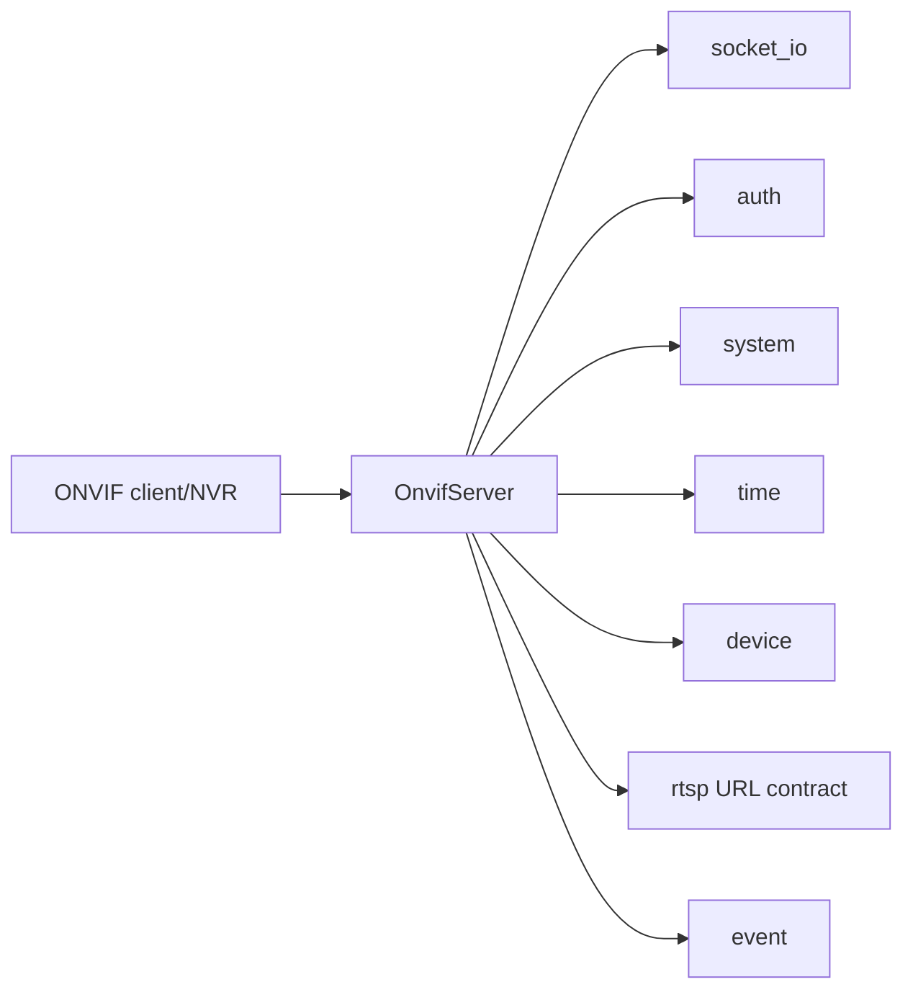

# onvif

## 命名迁移

本模块命名迁移遵循`docs/refactor/README.md` 的命名规则。后续目录、静态库、public header、接口类、Options/Stats、工厂函数和变量名只按该基线迁移；本文件中的旧 `_service`、`stream_*`、`MetaRtc*` 或 `Yang*` 名称仅表示迁移前名称、历史说明或明确允许保留的协议概念。HTTP REST 路径、配置 schema、Web DTO 和 ONVIF 返回路径可以随完全重构同步迁移；变更必须在同一任务内更新调用方、配置样例和文档，不保留旧兼容适配。

## 模块定位

`onvif` 负责设备端 ONVIF WS-Discovery、device/media service、
SOAP/XML/HTTP 响应和 ONVIF 认证。它不拥有 RTSP session 内部状态，不拼接 RTSP
端口或 stream path，也不直接构造 Web UI。

## 总体框架图

## 核心职责

- WS-Discovery Probe 响应，包含 EndpointReference、Types、Scopes 和 XAddrs。
- Device service 和 Media service SOAP 响应。
- ONVIF auth。
- 从 `rtsp` public 契约读取 RTSP listen address 和 stream path，输出 media
  profile 的 RTSP URL。
- 按固定 `/snapshot/{stream}.jpg` HTTP 契约生成 snapshot URL。

## 接口归属

public API 在 `onvif_server.h`。ONVIF advertise host、manufacturer、model、
firmware version 等运行参数由 app 加载后传入。

`OnvifServer::ApplyOptions()` 支持运行态更新 `advertise_ip`、认证开关、厂商/型号/
固件版本和 HTTP 端口，用于后续 discovery、device/media SOAP 响应。  
其中 `firmware_version` 的运行来源统一由编译时 `RELEASE_VERSION`
（`LIVE_STREAM_RELEASE_VERSION`）决定，`onvif.firmware_version` 仍保留于配置兼容，不作为运行时输入。
`device_service_port`、`discovery_port`、`discovery_enabled`、`service_path` 和
request size 上限涉及 TCP/UDP listener 或 parser 边界，运行时修改会被 app 的
config attachment 拒绝，必须重启后生效。

`CreateOnvifServer()` 不接收 `*Dependencies` 依赖包；基础服务从 `Runtime`
读取，RTSP 只读入口从 `ServiceRegistry::Rtsp()` 读取，组合根只显式传入
socket_io loop、`ISystem`、`ITime` 和 `DeviceMedia`。ONVIF media service 只调用
`IRtspSessionReader::LocalAddress()` 和 `rtsp.h` 中的 RTSP URL helper；
RTSP path 和 URL 拼接规则归 `rtsp` 模块所有。

内部实现按职责拆分为 `OnvifServer`、`onvif_discovery`、`onvif_device`、
`onvif_media`、`onvif_http`、`onvif_soap` 和 `onvif_auth`。ONVIF 规范里的
device/media service 概念可以保留在协议字段和 SOAP 语义中，但模块不保留旧
public API 兼容入口。

## 状态与资源模型

ONVIF 运行状态包含 discovery socket、HTTP/SOAP request context 和认证校验上下文。
设备信息、时间和媒体能力从相邻服务获取；RTSP URL 从 `rtsp` public 契约获取；
snapshot URL 由 ONVIF 使用 HTTP 端口和固定 `/snapshot/{stream}.jpg` 契约生成。

## 非目标

- 不维护 RTSP session 或媒体帧缓存。
- 不拥有 Web UI、HTTP API DTO 或设备 SDK 状态。

## 风险与优化方向

- ONVIF metadata 不应复制 RTSP session 状态。
- 认证逻辑要和 factory password 策略一致。
- SOAP/XML 响应字段变化需要兼容 NVR 客户端。
