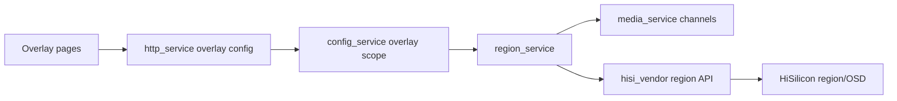

# region_service Design

## 模块定位

`region_service` 拥有文字叠加和隐私遮挡配置应用、region 生命周期和
`hisisdk::IHisiSdk` region 接口调用。配置/API 命名统一使用 `overlay`。

## 总体框架图

## 核心职责

- 校验和应用 text OSD、privacy mask 配置。
- 管理 region create、attach、update、detach、destroy 生命周期。
- 通过 `media_service` 获取 channel 绑定信息，通过 `hisi_vendor` 调用 SDK。

## 接口归属

public API 在 `region_service.h`。`GET/PUT /api/config/overlay` 的业务语义归本
模块，HTTP 只负责 DTO 转换。

## 非目标

- 不新增单独 `osd_service`。
- 不在本模块直接写 HiSilicon MPI 结构转换；转换留在 `hisi_vendor`。
- 不拥有 Web 遮挡编辑器状态。

## 风险与优化方向

- 区域配置热应用失败必须清理半创建 region，避免遮挡残留。
- 隐私遮挡涉及画面安全，配置保存和硬件应用状态要一致。
