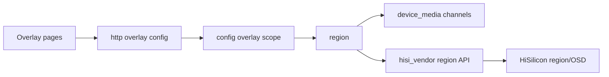

# region

## 命名迁移

本模块命名迁移遵循仓库根目录 `重构.md` 的“任务 1 命名迁移基线”。后续目录、静态库、public header、接口类、Options/Dependencies/Stats、工厂函数和变量名只按该基线迁移；本文件中的旧 `_service`、`stream_*`、`MetaRtc*` 或 `Yang*` 名称仅表示迁移前名称、历史说明或明确允许保留的协议概念。HTTP REST 路径、配置 schema、Web DTO 和 ONVIF 返回路径可以随完全重构同步迁移；变更必须在同一任务内更新调用方、配置样例和文档，不保留旧兼容适配。

## 模块定位

`region` 拥有文字叠加和隐私遮挡配置应用、region 生命周期和
`hisisdk::IHisiSdk` region 接口调用。配置/API 命名统一使用 `overlay`。

## 总体框架图

## 核心职责

- 校验和应用 text OSD、privacy mask 配置。
- 管理 region create、attach、update、detach、destroy 生命周期。
- 通过 `device_media` 获取 channel 绑定信息，通过 `hisi_vendor` 调用 SDK。

## 接口归属

public API 在 `region.h`。`GET/PUT /api/config/overlay` 的业务语义归本
模块，HTTP 只负责 DTO 转换。

## 非目标

- 不新增单独 `osd_service`。
- 不在本模块直接写 HiSilicon MPI 结构转换；转换留在 `hisi_vendor`。
- 不拥有 Web 遮挡编辑器状态。

## 状态与资源模型

region 状态由 overlay 配置、media channel 绑定和 SDK region 句柄共同决定。热应用时
必须先校验配置，再按 create/attach/update/detach/destroy 顺序收敛硬件状态；失败时
不能留下与配置不一致的遮挡或 OSD。

## 风险与优化方向

- 区域配置热应用失败必须清理半创建 region，避免遮挡残留。
- 隐私遮挡涉及画面安全，配置保存和硬件应用状态要一致。
