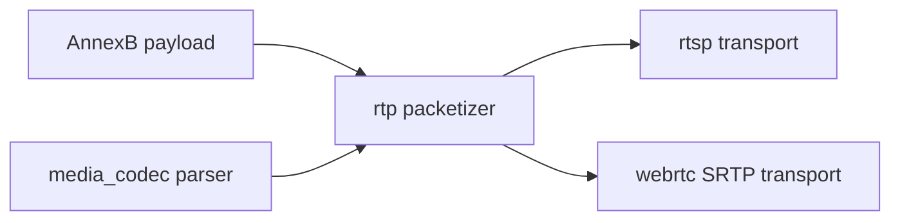

# rtp

## 模块定位

`rtp` 提供 RTSP 和 WebRTC 共享的 video RTP packetizer、packet view 和 RTP 常量。
它只负责把 H.264/H.265 AnnexB video frame 分片成 RTP packet view，不拥有
session、socket、SRTP、SDP、媒体源缓存或 FLV/HLS 封装状态。

## 总体框架图

## 核心职责

- 提供 `RtpPacketizer`，支持 H.264/H.265 AnnexB NAL 解析和 FU-A/FU 分片。
- 提供 `RtpPacketView` / `RtpPacketSlice`，让 RTSP/WebRTC 以 slice 方式发送 RTP
  header、payload header 和原始 media payload。
- 固定 video RTP clock rate 为 90000，默认 payload type 为 H.264 96、H.265 98。

## 接口归属

public API 在 `rtp.h`，归 `live_stream::rtp` 命名空间。`rtp` 依赖
`media_codec` 解析 H.264/H.265 NAL，不依赖 `media_source`、RTSP、WebRTC、HTTP、
FLV 或 HLS。

`RtpPacketizerInput` 只接收 `rtp::Codec`、AnnexB payload、PTS、payload type、
sequence 和 SSRC，不直接依赖 `EncodedFrame` 或设备侧媒体类型。`pts_us` 必须使用
媒体层修正后的 PTS。`RtpPacketView` 输出后立即交给 RTSP transport 或 WebRTC
SRTP；异步发送时调用方必须通过自己的 owner 机制保持底层媒体 buffer 生命周期。

## 非目标

- 不构造 FLV tag、HLS segment、TS packet 或 SDP。
- 不保存 peer/session/client/socket 状态。
- 不解析音频 codec 或生成音频 RTP。
