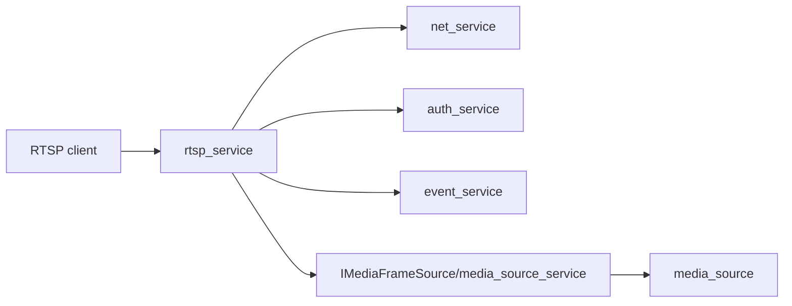

# rtsp_service Design

## 模块定位

`rtsp_service` 负责 RTSP protocol、session、认证和从 `IMediaFrameSource` 拉取视频
帧。它不拥有 WebRTC signaling、HTTP API 路由或 ONVIF metadata。

## 总体框架图

## 核心职责

- 监听 RTSP 端口并管理 sessions。
- 处理 DESCRIBE/SETUP/PLAY/TEARDOWN 等 RTSP 控制。
- 通过认证服务保护 RTSP 访问。
- 从 `media_source_service` 获取视频帧并输出 RTP。

## 接口归属

public API 在 `rtsp_service.h`。RTSP URL 可被 ONVIF URI provider 使用，但 RTSP
内部 session 状态不归 ONVIF。

## 风险与优化方向

- RTSP 客户端断开必须及时解除 frame sink。
- 关键帧请求应通过 `IMediaFrameSource::RequestKeyFrame` 进入媒体链路。
