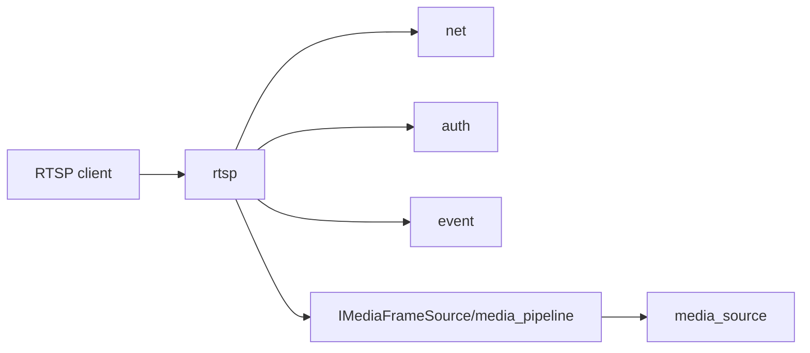

# rtsp

## 命名迁移

本模块命名迁移遵循仓库根目录 `重构.md` 的“任务 1 命名迁移基线”。后续目录、静态库、public header、接口类、Options/Dependencies/Stats、工厂函数和变量名只按该基线迁移；本文件中的旧 `_service`、`stream_*`、`MetaRtc*` 或 `Yang*` 名称仅表示迁移前名称、历史说明或明确允许保留的协议概念。HTTP REST 路径、配置 schema、Web DTO 和 ONVIF 返回路径可以随完全重构同步迁移；变更必须在同一任务内更新调用方、配置样例和文档，不保留旧兼容适配。

## 模块定位

`rtsp` 负责 RTSP protocol、session、认证和从 `IMediaFrameSource` 拉取视频
帧。它不拥有 WebRTC signaling、HTTP API 路由或 ONVIF metadata。

## 总体框架图

## 核心职责

- 监听 RTSP 端口并管理 sessions。
- 处理 DESCRIBE/SETUP/PLAY/TEARDOWN 等 RTSP 控制。
- 通过认证服务保护 RTSP 访问。
- 从 `media_pipeline` 获取视频帧并输出 RTP。

## 接口归属

public API 在 `rtsp.h`。RTSP URL 可被 ONVIF URI provider 使用，但 RTSP
内部 session 状态不归 ONVIF。

## 状态与资源模型

RTSP session 拥有控制连接、RTP/RTCP 传输状态、认证上下文和 frame sink 注册。
PLAY 后必须通过 `IMediaFrameSource` 取帧，TEARDOWN 或断连时必须释放 sink。

## 非目标

- 不拥有 HLS/FLV/MJPEG/WebRTC 浏览器预览状态。
- 不直接访问 `device_media` 或 HiSilicon SDK。

## 风险与优化方向

- RTSP 客户端断开必须及时解除 frame sink。
- 关键帧请求应通过 `IMediaFrameSource::RequestKeyFrame` 进入媒体链路。
