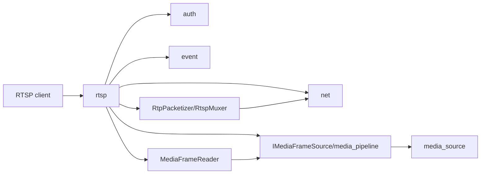

# rtsp

## 命名迁移

本模块命名迁移遵循仓库根目录 `重构.md` 的“任务 1 命名迁移基线”。后续目录、静态库、public header、接口类、Options/Dependencies/Stats、工厂函数和变量名只按该基线迁移；本文件中的旧 `_service`、`stream_*`、`MetaRtc*` 或 `Yang*` 名称仅表示迁移前名称、历史说明或明确允许保留的协议概念。HTTP REST 路径、配置 schema、Web DTO 和 ONVIF 返回路径可以随完全重构同步迁移；变更必须在同一任务内更新调用方、配置样例和文档，不保留旧兼容适配。

## 模块定位

`rtsp` 负责 RTSP protocol、session、认证和通过 `IMediaFrameSource`
reader 拉取视频帧。它不拥有 WebRTC signaling、HTTP API 路由或 ONVIF
metadata。

## 总体框架图

## 核心职责

- 监听 RTSP 端口并管理 sessions。
- 处理 DESCRIBE/SETUP/PLAY/TEARDOWN 等 RTSP 控制。
- 通过认证服务保护 RTSP 访问。
- DESCRIBE 只在 `MediaTrack.ready=true` 时生成 SDP；stream 不存在返回 404，
  stream 存在但媒体 track 尚未 ready 返回 455。
- PLAY 后为 session 创建 `MediaFrameReader`，先输出启动 GOP，再拉取 live
  frame 并通过 `rtp::RtpPacketizer` 输出 RTP。
- SETUP 绑定 TCP interleaved 或 session 私有 UDP RTP/RTCP transport。

## 接口归属

public API 在 `rtsp.h`。RTSP URL 可被 ONVIF URI provider 使用，但 RTSP
内部 session 状态不归 ONVIF。`RtspStreamPath()` 和 `BuildRtspStreamUrl()` 是
跨模块唯一的 stream path/URL 契约，调用方只能配合 `IRtsp::LocalAddress()` 使用，
不得在其它模块复制 `/live/main`、`/live/sub` 或 RTSP 端口拼接规则。Web 获取
RTSP URL 只能通过 `GET /api/media/streams/{stream}/urls`，由后端结合 Host、
RTSP 端口、认证配置和 stream 生成完整 URL。

## 状态与资源模型

RTSP session 拥有控制连接、RTP/RTCP 传输状态、认证上下文、
`MediaFrameReaderId`、RTP sequence/SSRC 和发送统计。PLAY 后必须通过
`AttachFrameReader(keyframe_first=true)` 进入 reader 模型：

- `GetFrameReaderStartData` 返回的当前 GOP 只作为启动待发送帧临时持有，
  发送后立即释放，不在 RTSP 内部维护私有 GOP cache。
- live frame 通过 `PopFrameReaderFrame` 拉取，RTSP 不再注册全局
  `AttachFrameSink` fanout。
- TCP interleaved 与控制连接绑定；UDP SETUP 为该 session 创建 RTP 和 RTCP
  socket，RTCP 包当前只做基础接收忽略，避免客户端 receiver report 影响连接。
- TEARDOWN、控制连接断开、SETUP 切换 transport 或服务停止时必须取消发送
  timer、detach reader，并关闭 session 私有 UDP socket。

RTP 分片统一使用 `rtp::RtpPacketizer`。发送层只负责把
`RtpPacketView` 转成 TCP interleaved 或 UDP datagram。TCP interleaved 提交
interleaved header slice 和 RTP packet view，media payload slice 异步发送时由
`net` 的 `NetBufferOwner` 保留底层 `VideoBuffer` 引用；UDP 使用同步
`sendmsg` 发送 packet view，不保留无主 owner 引用。

`RtspSessionDiagnostics` 字段冻结为：

| 字段 | 语义 |
| --- | --- |
| `session_id` | RTSP session id |
| `stream` | `main` 或 `sub` |
| `transport` | `tcp_interleaved` 或 `udp` |
| `remote_address` / `local_address` | 控制连接地址 |
| `reader_id` | 当前 `MediaFrameReaderId`，未 PLAY 时为 0 |
| `pending_bytes` | TCP interleaved 发送积压字节数，UDP session 为 0 或诊断值 |
| `rtp_packets` / `rtp_bytes` | 已发送 RTP 统计 |
| `close_reason` | 来自 `net` 或 RTSP close path 的关闭原因 |

`IRtsp::GetSessionDiagnostics()` 输出当前 RTSP sessions 的上述字段；pending
bytes 和 close reason 优先读取 `net` 的 connection diagnostics。这些字段由
`/api/media/sessions` 聚合给 Web；RTSP 模块只提供协议诊断，不提供
HLS/FLV/MJPEG/WebRTC ready 状态。

## 非目标

- 不拥有 HLS/FLV/MJPEG/WebRTC 浏览器预览状态。
- 不直接访问 `device_media` 或 HiSilicon SDK。

## 风险与优化方向

- RTSP 客户端断开必须及时 detach reader，`media_source` 的 reader count 应回落。
- reader 溢出时会由 `media_source` 标记 slow reader 并等待下一个关键帧；
  RTSP 只维护协议统计和连接状态，不触发降码率、降帧率、切子码流等自适应策略。
- 关键帧请求由 `AttachFrameReader(keyframe_first=true)` 触发媒体链路，
  RTSP 不额外维护关键帧调试开关。
