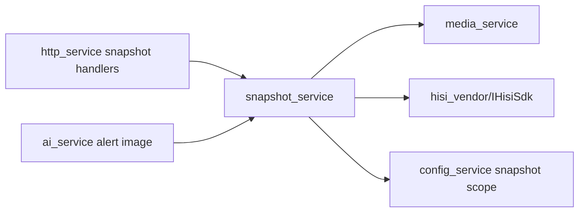

# snapshot_service Design

## 模块定位

`snapshot_service` 拥有 JPEG 抓图策略和 snapshot view。它通过 `media_service`
和 `hisi_vendor` 获取图像，不拥有 HTTP 路由、静态文件服务或 Web 展示。

## 总体框架图

## 核心职责

- 读取和应用 snapshot 配置。
- 按 stream/channel 获取 JPEG 抓图。
- 为 HTTP 和 AI 提供窄接口 `ISnapshotView`。

## 接口归属

public API 在 `snapshot_service.h`。`GET /api/snapshot/main.jpg` 和
`GET /api/snapshot/sub.jpg` 的路由归 HTTP，抓图能力和配置语义归本模块。

## 状态与资源模型

抓图是低频动作，但会访问媒体和 SDK 资源。失败时返回明确失败状态，不影响实时
预览主链路。

## 风险与优化方向

- 抓图不能阻塞帧路径锁。
- AI 告警图片复用 snapshot 能力时，不应把 AI 图片存储策略放入 snapshot 模块。
