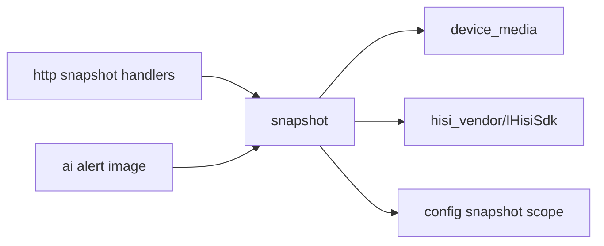

# snapshot

## 命名迁移

本模块命名迁移遵循仓库根目录 `重构.md` 的“任务 1 命名迁移基线”。后续目录、静态库、public header、接口类、Options/Dependencies/Stats、工厂函数和变量名只按该基线迁移；本文件中的旧 `_service`、`stream_*`、`MetaRtc*` 或 `Yang*` 名称仅表示迁移前名称、历史说明或明确允许保留的协议概念。HTTP REST 路径、配置 schema、Web DTO 和 ONVIF 返回路径可以随完全重构同步迁移；变更必须在同一任务内更新调用方、配置样例和文档，不保留旧兼容适配。

## 模块定位

`snapshot` 拥有 JPEG 抓图策略和 snapshot view。它通过 `device_media`
和 `hisi_vendor` 获取图像，不拥有 HTTP 路由、静态文件服务或 Web 展示。

## 总体框架图

## 核心职责

- 读取和应用 snapshot 配置。
- 按 stream/channel 获取 JPEG 抓图。
- 为 HTTP 和 AI 提供窄接口 `ISnapshotView`。

## 接口归属

public API 在 `snapshot.h`。`GET /api/snapshot/main.jpg` 和
`GET /api/snapshot/sub.jpg` 的路由归 HTTP，抓图能力和配置语义归本模块。

## 状态与资源模型

抓图是低频动作，但会访问媒体和 SDK 资源。失败时返回明确失败状态，不影响实时
预览主链路。

## 非目标

- 不提供录像、连拍归档或回放索引。
- 不拥有 HTTP route、静态文件服务或 AI 告警图片保留策略。

## 风险与优化方向

- 抓图不能阻塞帧路径锁。
- AI 告警图片复用 snapshot 能力时，不应把 AI 图片存储策略放入 snapshot 模块。
