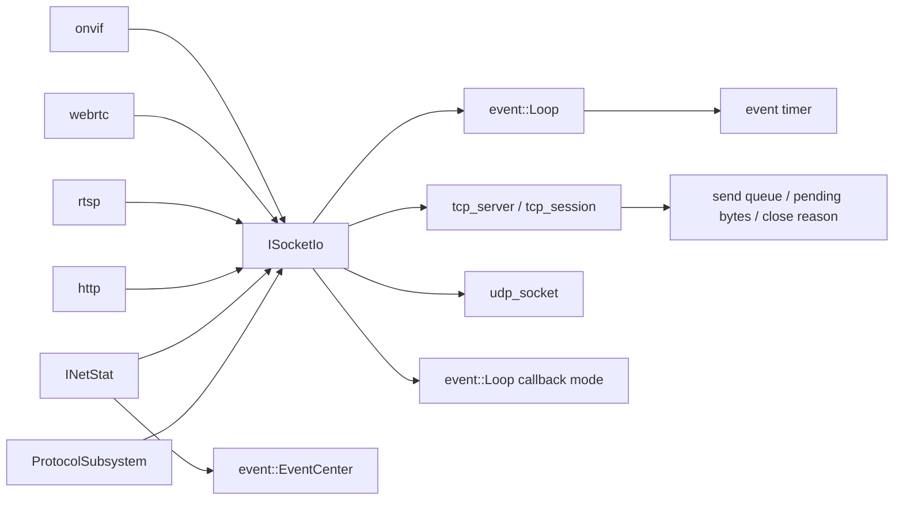

# socket_io

## 模块定位

`socket_io` 是进程内共享 socket 引擎，负责 IO loop、TCP server/session、
UDP socket、发送队列、pending bytes、timeout 和慢客户端观测。它只处理 socket
生命周期和网络发送，不拥有 HTTP、RTSP、ONVIF、WebRTC 或媒体业务语义。

public API 在 `socket_io.h` 和 `net_stat.h`：

- `ISocketIo`：TCP/UDP socket 能力入口。
- `SocketIoOptions`：IO thread、callback loop 和队列配置。
- `SocketWriteSlices`：异步发送 slice，允许携带 `MediaBufferRef` 保活媒体 payload。
- `INetStat`：基于 `SocketConnectionInfo` 的发送队列观测和慢客户端识别。

## 总体框架图

## 核心职责

- 管理 IO thread、`event::Loop` 执行域和 callback dispatch。
- 提供 TCP server/session、UDP socket、fd 和 eventfd 封装。
- 统一 TCP send queue、pending bytes、发送 buffer 上限、读写 timeout、
  send stall 检测和 close reason。
- 用 `SocketConnectionInfo` 暴露活跃连接和最近关闭连接的只读诊断。
- 用 `INetStat` 采样 pending bytes / send queue，输出 `NetQueueLevel`、
  `NetMetric`、`NetSlowClient` 和 `NetConnectionQueue`。
- 发布 `kNetQueueChanged` 轻量事件，SSE 事件名为 `net_queue_changed`。
- 提供 UDP `SendTo()` 和 selected peer 模型，供 RTP、ICE/STUN、ONVIF
  discovery 接入。

## 接口归属

`ISocketIo` 是协议模块依赖的唯一 socket 抽象。协议模块只保存 connection/socket id
和自身 session 状态，不保存 `SocketIoImpl`、`TcpSession`、`TcpServer` 或
`UdpSocket` 内部对象指针。

冻结契约：

- `event::Loop`：代表一个 socket IO 执行域，提供 `Post()`、`RunAfter()`、
  `RunEvery()`、`CancelTimer()` 和 `IsCurrentThread()`。loop 只能由同一个
  `ISocketIo` 生命周期内使用。
- `TcpServer`：`ListenTcp(loop, ...)` 创建监听，accept 和 accepted session
  绑定到指定 loop。`CloseTcp()` 停止 accept；已有 session 由上层按连接 id
  关闭。
- `TcpSession`：发送统一走 `Send()` / `SendSlices()`。队列满关闭原因为
  `queue_full`，pending bytes 超过上限关闭原因为 `pending_limit`。
- `TcpCloseReason`：`on_close` 必须携带关闭原因。协议模块用它释放媒体订阅、
  记录慢客户端和区分 peer/local/timeout/error。
- `UdpSocket`：`BindUdp(loop, ...)` / `CloseUdp()` 管生命周期；`SetUdpPeer()`、
  `SendToPeer()` 用于已选择 peer 的 RTP 或 ICE/STUN，`SendTo()` 用于逐包目标地址。
- `SocketWriteSlices`：只表达 socket 发送 buffer。跨线程或异步 TCP 发送媒体
  payload 时，slice 可以携带 `MediaBufferRef`，不能携带协议业务语义。

`TcpCloseReason` 枚举值冻结为：`normal`、`remote_close`、`parse_error`、
`auth_failed`、`queue_full`、`pending_limit`、`send_stall`、`read_timeout`、
`write_timeout`、`internal_error`。

`SocketConnectionInfo` 字段语义：

| 字段 | 语义 |
| --- | --- |
| `connection_id` | TCP connection id |
| `owner_protocol` | `http`、`rtsp`、`onvif` 等上层协议 |
| `remote_address` / `local_address` | 文本地址和端口 |
| `pending_bytes` | 当前等待发送的总字节数 |
| `send_queue_length` | 当前等待发送的队列长度 |
| `last_write_at_ms` | 最近一次成功写 socket 的时间 |
| `close_reason` | 关闭后保留的 `TcpCloseReason` |
| `open` | 是否仍在活跃连接表中 |

`GetConnectionInfo(connection_id)` 返回单连接诊断。连接关闭后保留最近 128 条关闭
诊断，`ListConnectionInfo()` 同时返回当前活跃连接和最近关闭连接，供
`/api/media/sessions` 聚合。

## NetStat 契约

`net_stat.h` 随 `socket_io` 模块构建，不是独立模块。`CreateNetStat()` 接收
`NetStatOptions`、非 owning `ISocketIo*` 和可选 `event::EventCenter*`。
组合根负责保证这两个入口的生命周期覆盖 `INetStat::Stop()` 和对象销毁；
`net_stat` 不从 `Runtime` 反向查找服务，也不直接依赖 `rtsp`、`webrtc` 或
`media`。组合根通过 `ServiceRegistry::RegisterNetStat()` 暴露只读诊断入口，
供 HTTP 聚合 `/api/media/sessions` summary；registry 不提供慢客户端控制能力。

等级和指标：

| 类型 | 语义 |
| --- | --- |
| `NetQueueLevel::kNormal` | 发送队列正常 |
| `NetQueueLevel::kWarning` | pending bytes 或 send queue 达到预警线 |
| `NetQueueLevel::kCritical` | 达到慢客户端处理线 |
| `NetMetric::kTcpPendingBytes` | TCP pending bytes 触发 |
| `NetMetric::kSendQueue` | TCP send queue length 触发 |

`NetStatSnapshot::active_rtsp_sessions` 来自 RTSP client 事件携带的当前 session
数；`NetStatSnapshot::open_webrtc_peers` 来自 WebRTC client 事件携带的当前 open
peer 数，包含 setup/connecting/connected，不能等同为已完成连接的 peer 数。
`NetStatSnapshot::slow_clients` 和 `slow_client_history_entries` 是当前慢客户端
输出和慢客户端历史条目数量，HTTP summary 只读取数量，不复制连接级历史对象。

`NetStatOptions` 默认阈值：

| 字段 | 默认值 | 语义 |
| --- | --- | --- |
| `check_interval_ms` | 1000 | 采样间隔 |
| `pending_bytes_warning` | 256 KiB | pending bytes 预警线 |
| `pending_bytes_critical` | 768 KiB | pending bytes 慢客户端线 |
| `send_queue_warning` | 32 | send queue 预警线 |
| `send_queue_critical` | 96 | send queue 慢客户端线 |
| `critical_check_threshold` | 2 | 连续 critical 后才输出慢客户端 |
| `recovery_check_threshold` | 5 | 连续 normal 后清理拥塞起始时间 |
| `slow_client_cooldown_ms` | 5000 | 同一连接慢客户端输出冷却 |
| `slow_client_history_limit` | 64 | 慢客户端历史上限 |

整体队列等级变化时发布 `kNetQueueChanged`：

| 字段 | 语义 |
| --- | --- |
| `source` | `net_stat` |
| `target` | `connections` |
| `msg` | `net_queue_normal`、`net_queue_warning`、`net_queue_critical` |
| `value` | 当前跟踪的连接队列记录数 |
| `level` | `NetQueueLevel` 数值 |

## 状态与资源模型

`ISocketIo` 拥有 IO thread、event loop、fd/eventfd、TCP/UDP socket 和 callback
dispatch 队列。组合根为 HTTP、RTSP、ONVIF 和 WebRTC 分别通过 `PickLoop()`
选择执行域；协议模块的监听、accepted session、UDP socket 和协议 timer 都绑定到
注入的 loop。

上层协议停止时必须先解除连接、session、timer 或 endpoint，再停止 socket 引擎。
板端默认按 Hi3516DV300 双核 Cortex-A7 配置 2 个 socket IO thread；线程亲和性是
`SocketIoOptions` 的可选实验项，默认关闭。

TCP session 内部持有有界发送队列。无 buffer 的小 slice 会内联复制，大 slice 会
复制到网络 buffer；带 `MediaBufferRef` 的 slice 只持有引用，由 RAII 保证跨线程和
异步发送期间 payload 存活。写侧按 slice 组 `sendmsg()` 聚合发送；部分写成功后按
实际写入字节推进 offset 并释放已完成队列项。

HTTP、RTSP、ONVIF 和 WebRTC 不各自维护不可比较的 socket 发送队列。长连接只能通过
`ISocketIo` 的 pending bytes、connection info 和 close callback 观察慢客户端。

## 非目标

- 不解析 HTTP、RTSP、ONVIF、WebRTC 业务协议。
- 不维护认证、路由、媒体 ready 或客户端业务状态。
- 不解析 RTP、RTSP interleaved、HTTP chunk、WebRTC STUN/DTLS/SRTP 等协议包。
- 不通过 `EventCenter` 传递媒体帧、大 JSON 或业务控制命令。

## 风险与优化方向

- 回调队列容量要匹配协议吞吐，避免流量高峰时无限堆积。
- 网络关闭必须先停止上层协议，再释放 `ISocketIo`。
- `send_buffer_limit_bytes` 需要按 HTTP-FLV/HLS/MJPEG、RTSP TCP interleaved 和
  WebRTC signaling 的峰值分别配置，避免慢客户端持有过多媒体 payload 引用。
- `CallbackMode::kPostToLoop` 会复制接收数据；热路径协议应缩短回调处理，避免
  callback loop 队列成为新的内存堆积点。
