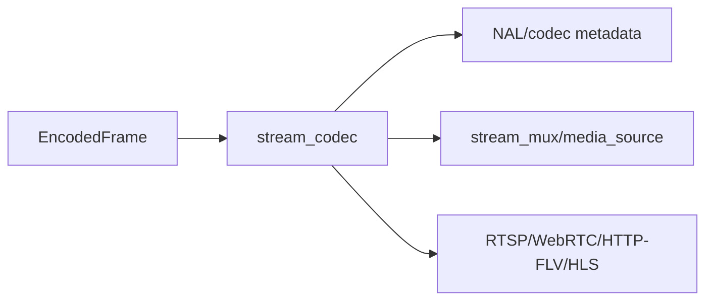

# stream_codec Design

## 模块定位

`stream_codec` 提供 H.264/H.265/MJPEG 等码流解析和格式辅助能力。它是媒体和协议
热路径的工具模块，不拥有 client session、HTTP 路由或媒体源状态。

## 总体框架图

## 核心职责

- 解析 codec metadata、关键帧和 parameter sets。
- 为 HLS/FLV/RTP 等下游封装提供必要的 codec 信息。
- 保持无业务状态或极少状态，供热路径复用。

## 接口归属

public API 在 `stream_codec.h`，归 `stream_codec` 命名空间：

- AnnexB NAL 遍历：`ForEachAnnexBNalUnit`、`IAnnexBNalUnitSink`。
- H.264/H.265 NAL 列表：`H264NalUnitList`、`H265NalUnitList`。
- parameter set 和 keyframe 判断：`Has*ParameterSets`、`Has*KeyFrame`。
- parameter set 提取：`ExtractH264ParameterSets`、`ExtractH265ParameterSets`。

## 状态与资源模型

NAL list 是栈上固定容量结构，最多记录 `kMaxNalUnitsPerFrame` 个单帧 NAL。`overflow`
只表示输入超过可记录数量，上层必须把它当作解析风险处理。模块不持有
`EncodedFrame`、不复制 payload 所有权，也不缓存 codec 状态。

## 非目标

- 不拥有 HLS/FLV/RTP 封装输出。
- 不维护 GOP cache、sequence header cache 或媒体 ready 状态。
- 不处理音频 codec。

## 风险与优化方向

- 解析函数应避免重复分配和大拷贝。
- codec 切换必须让上层重建 sequence/header/cache。
