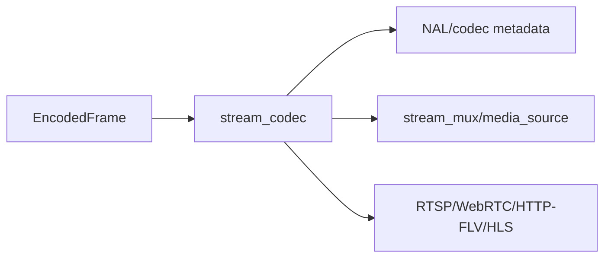

# stream_codec Design

## 模块定位

`stream_codec` 提供 H.264/H.265/MJPEG 等码流解析和格式辅助能力。它是媒体和协议
热路径的工具模块，不拥有 client session、HTTP 路由或媒体源状态。

## 总体框架图

## 核心职责

- 解析 codec metadata、关键帧和 parameter sets。
- 为 HLS/FLV/RTP 等下游封装提供必要的 codec 信息。
- 保持无业务状态或极少状态，供热路径复用。

## 风险与优化方向

- 解析函数应避免重复分配和大拷贝。
- codec 切换必须让上层重建 sequence/header/cache。
