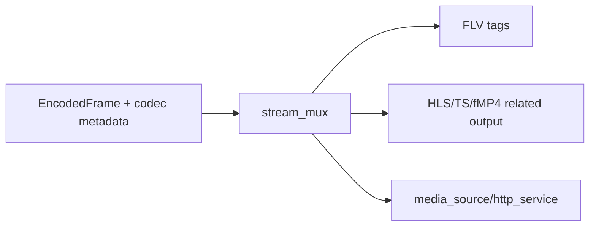

# stream_mux Design

## 模块定位

`stream_mux` 提供媒体封装辅助，例如 HLS、FLV 或其他下游协议需要的输出构造。
它不拥有客户端注册、HTTP socket、playlist 状态或媒体源生命周期。

## 总体框架图

## 核心职责

- 把编码帧和 codec metadata 转成下游协议需要的封装片段。
- 尽量输出 slice/view，减少热路径 string 拼接和 payload 拷贝。

## 风险与优化方向

- 高容量封装输出不能每帧反复分配大 buffer。
- `media_source` 负责缓存和 ready 状态；`stream_mux` 只负责封装构造。
