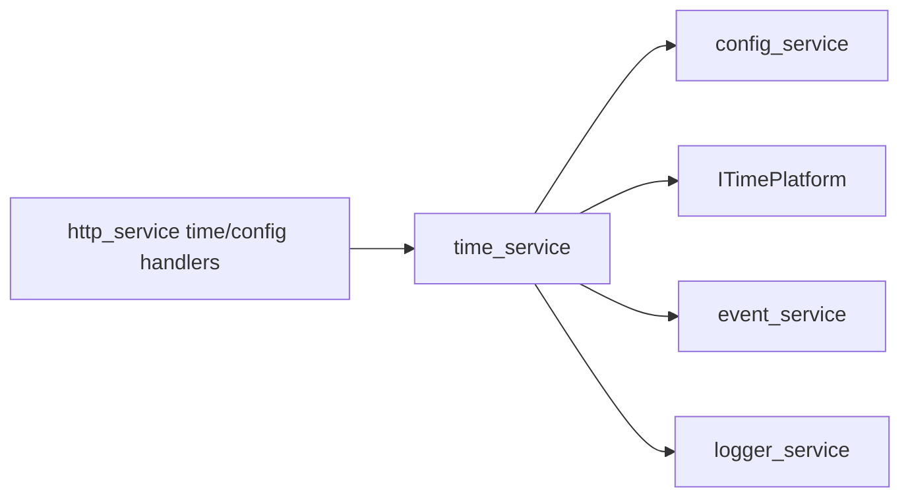

# time_service Design

## 模块定位

`time_service` 负责系统时间、时区/NTP 配置和时间应用。它通过 `ITimePlatform`
调用平台能力，不拥有网络接口管理或浏览器时间格式化。

## 总体框架图

## 核心职责

- 加载和应用时间/NTP 配置。
- 提供时间状态查询。
- 发布 `kTimeChanged` 并记录运维操作。

## 接口归属

public API 在 `time_service.h`。前端只消费 HTTP 返回值，不负责设备时间应用策略。

## 状态与资源模型

时间配置来自 `time` scope，平台应用通过 `ITimePlatform` 完成。NTP 配置、时区和手动
校时会影响日志时间、认证过期和媒体时间戳相关展示，变更时必须发布 `kTimeChanged`。

## 非目标

- 不管理网络接口或 DNS 配置。
- 不由浏览器本地时间替代设备时间状态。

## 风险与优化方向

- 时间跳变会影响日志、HLS segment 时间和认证过期判断，需要记录关键变更。
- NTP 配置失败应返回明确错误，不应静默写入不可用配置。
