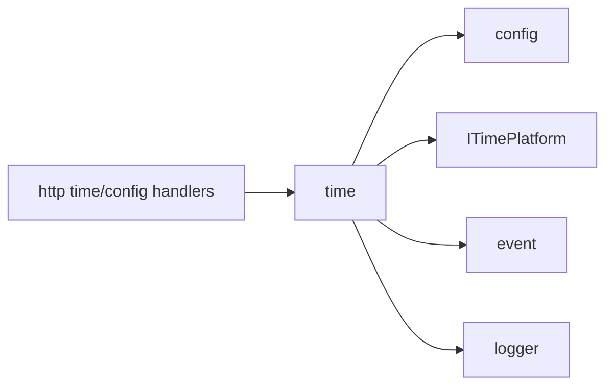

# time

## 命名迁移

本模块命名迁移遵循仓库根目录 `重构.md` 的“任务 1 命名迁移基线”。后续目录、静态库、public header、接口类、Options/Dependencies/Stats、工厂函数和变量名只按该基线迁移；本文件中的旧 `_service`、`stream_*`、`MetaRtc*` 或 `Yang*` 名称仅表示迁移前名称、历史说明或明确允许保留的协议概念。HTTP REST 路径、配置 schema、Web DTO 和 ONVIF 返回路径可以随完全重构同步迁移；变更必须在同一任务内更新调用方、配置样例和文档，不保留旧兼容适配。

## 模块定位

`time` 负责系统时间、时区/NTP 配置和时间应用。它通过 `ITimePlatform`
调用平台能力，不拥有网络接口管理或浏览器时间格式化。

## 总体框架图

## 核心职责

- 加载和应用时间/NTP/浏览器登录校时配置。
- 提供时间状态查询。
- 发布 `kTimeChanged` 并记录运维操作。

## 接口归属

public API 在 `time.h`。前端只消费 HTTP 返回值，不负责设备时间应用策略。

## 状态与资源模型

时间配置来自 `time` scope，平台应用通过 `ITimePlatform` 完成。NTP 配置、时区、
手动校时和浏览器校时会影响日志时间、认证过期和媒体时间戳相关展示，变更时必须发布
`kTimeChanged`。

`browser_sync_on_login` 控制 Web 账号密码登录成功后是否使用浏览器当前 Unix
毫秒时间同步一次设备时间，默认开启；已有配置缺字段时按开启处理。`manual_sync_allowed`
同时约束手动系统时间设置和浏览器时间设置。

## 非目标

- 不管理网络接口或 DNS 配置。
- 不由浏览器本地时间替代设备时间状态。

## 风险与优化方向

- 时间跳变会影响日志、HLS segment 时间和认证过期判断，需要记录关键变更。
- NTP 配置失败应返回明确错误，不应静默写入不可用配置。
