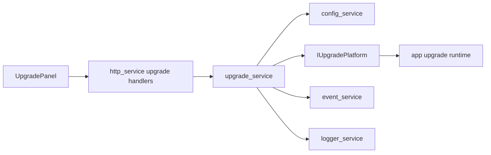

# upgrade_service Design

## 模块定位

`upgrade_service` 负责升级工作流状态、升级包接收后的校验入口、平台动作调用和进度
事件。SPI NOR 分区、MTD 写入和 `live_sysupgrade` 细节归
`../app/upgrade-runtime-design.md`。

## 总体框架图

## 核心职责

- 管理上传、校验、准备写入、写入、等待重启、取消等升级状态。
- 调用 `IUpgradePlatform` 完成包校验和平台动作。
- 发布 `kUpgradeProgressChanged`。
- 记录上传、启动、取消、确认重启等操作。

## HTTP API 归属

HTTP 路由由 `http_service` 实现，但业务语义归 `upgrade_service`：

- `POST /api/upgrade/upload?filename=<name>`
- `GET /api/upgrade/status`
- `POST /api/upgrade/start`
- `POST /api/upgrade/cancel`
- `POST /api/upgrade/confirm-reboot`

## 状态与资源模型

升级包上传后落入临时目录，校验完成前不得写 flash。状态必须足够支撑 Web 展示，
避免前端猜测进度。取消只对尚未进入不可中断写入阶段的流程生效。

## 风险与优化方向

- 写 flash 前必须校验签名、manifest、分区白名单和包完整性。
- 普通升级禁止写 `boot`。
- 升级失败应保留可查询错误原因并允许恢复到可再次上传状态。
