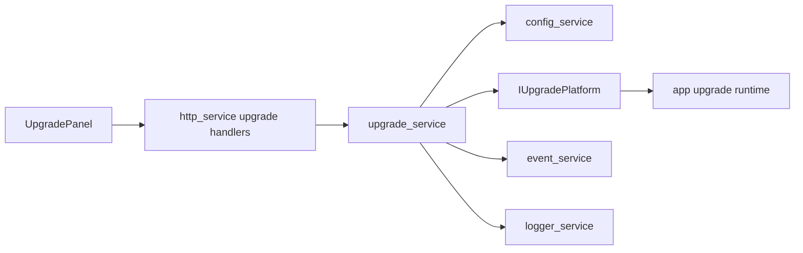

# upgrade_service Design

## 模块定位

`upgrade_service` 负责升级工作流状态、升级包接收后的校验入口、平台动作调用、进度
事件、发布包布局、32M SPI NOR 分区和 `live_sysupgrade` 写入边界。

## 总体框架图



## 核心职责

- 管理上传、校验、准备写入、写入、等待重启、取消等升级状态。
- 调用 `IUpgradePlatform` 完成包校验和平台动作。
- 发布 `kUpgradeProgressChanged`。
- 记录上传、启动、取消、确认重启等操作。

`IUpgradePlatform` 由 app 组合根创建并注入，它封装升级包校验、平台写入和重启确认
等板端动作；`upgrade_service` 不直接写 MTD。

## HTTP API 归属

HTTP 路由由 `http_service` 实现，但业务语义归 `upgrade_service`：

- `POST /api/upgrade/upload?filename=<name>`
- `GET /api/upgrade/status`
- `POST /api/upgrade/start`
- `POST /api/upgrade/cancel`
- `POST /api/upgrade/confirm-reboot`

## 状态与资源模型

升级包上传后落入临时目录，校验完成前不得写 flash。状态必须足够支撑 Web 展示，
避免前端猜测进度。取消只对尚未进入不可中断写入阶段的流程生效。

## 发布包和 SPI NOR

发布包由 `scripts/package_release.sh`、`scripts/package_debug.sh`、rootfs init
脚本和 PC 文件系统工具组织，包含 app binary、动态库、Web 静态资源、配置、公钥和
启动脚本。

32M SPI NOR 固定分区：

| 分区 | 起始地址 | 大小 | 挂载点 | 说明 |
| --- | ---: | ---: | --- | --- |
| `boot` | `0x00000000` | 1M | 无 | U-Boot + env，普通升级禁止写 |
| `kernel` | `0x00100000` | 4M | 无 | `uImage_hi3516dv300` |
| `rootfs` | `0x00500000` | 12M | `/` | jffs2 rootfs |
| `bin` | `0x01100000` | 10M | `/opt/app` | 主程序、动态库、脚本 |
| `web` | `0x01B00000` | 2M | `/www` | Web 静态资源 |
| `config` | `0x01D00000` | 1M | `/config` | 用户配置 |
| `data` | `0x01E00000` | 2M | `/data` | 日志、升级状态、运行数据 |

`mtdparts`:

```text
mtdparts=hi_sfc:1M(boot),4M(kernel),12M(rootfs),10M(bin),2M(web),1M(config),2M(data)
```

默认运行路径：

- 业务配置：`configs/business_config.json`
- 默认配置：`configs/default_config.json`
- 认证用户：`configs/auth_users.json`
- 操作日志：`log/operation.log`

生产部署使用 `/config`、`/data`、`/www`、`/opt/app` 等板端路径；`/tmp` 必须是 RAM
路径，升级临时目录不得落在 flash 长期分区。

## 非目标

- `upgrade_service` 不直接写 MTD，不绕过 `IUpgradePlatform`。
- 普通在线升级不写 `boot`，当前发布脚本禁用 `kernel-rootfs` 和 `full` profile。
- 不把 Web 上传进度当作 flash 写入完成状态。

## 风险与优化方向

- 写 flash 前必须校验签名、manifest、分区白名单和包完整性。
- 普通升级禁止写 `boot`。
- 升级失败应保留可查询错误原因并允许恢复到可再次上传状态。
- 发布包内容必须和 SPI NOR 分区大小匹配，Web 静态资源构建失败不能被旧 dist 掩盖。
