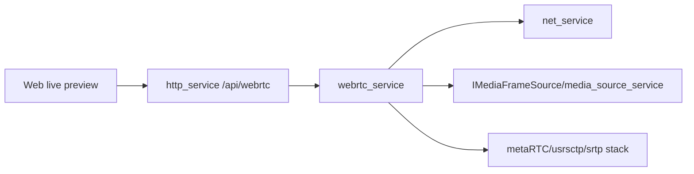

# webrtc_service Design

## 模块定位

`webrtc_service` 拥有 WebRTC peer/session、SDP/ICE、候选发送和媒体传输集成。
WebRTC 是一种预览链路，不应污染 HLS/FLV 主链路状态。

## 总体框架图

## 核心职责

- 创建和关闭 peer。
- 处理 offer、answer、ICE candidate。
- 从 `media_source_service` 接收视频帧并发送到 WebRTC transport。
- 暴露状态给 HTTP signaling handlers。

## 接口归属

public API 在 `webrtc_service.h`。HTTP signaling 路由归 `http_service`，Web 播放
状态归 `www`，媒体 ready 仍归 `media_source`。

## 状态与资源模型

WebRTC peer/session 拥有 SDP/ICE 状态、transport、frame sink 和 peer 上限。peer
关闭、ICE 失败或 HTTP close 时必须解除 frame sink，避免继续持有媒体帧引用。

## 非目标

- 不维护 HLS/FLV/MJPEG ready 或缓存。
- 不由 Web 前端推导 ICE/public IP 或媒体 codec 状态。

## 风险与优化方向

- WebRTC peer 生命周期必须和 frame sink 生命周期绑定。
- ICE/public IP 配置来自 runtime config，不能由 Web 前端推导。
- 失败时只影响 WebRTC 预览，不影响 HLS/FLV/MJPEG。
