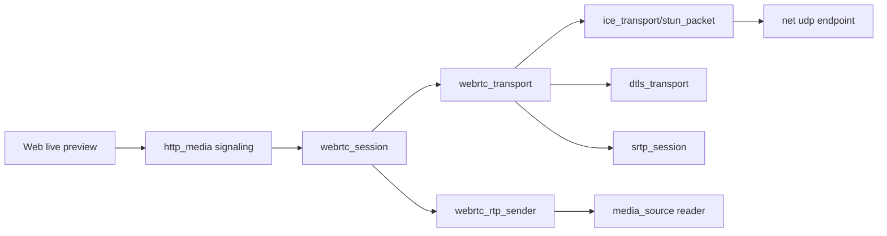

# webrtc

## 命名迁移

本模块命名迁移遵循仓库根目录 `重构.md` 的“任务 1 命名迁移基线”。后续目录、静态库、public header、接口类、Options/Dependencies/Stats、工厂函数和变量名只按该基线迁移；本文件中的旧 `_service`、`stream_*`、`MetaRtc*` 或 `Yang*` 名称仅表示迁移前名称、历史说明或明确允许保留的协议概念。HTTP REST 路径、配置 schema、Web DTO 和 ONVIF 返回路径可以随完全重构同步迁移；变更必须在同一任务内更新调用方、配置样例和文档，不保留旧兼容适配。

## 模块定位

`webrtc` 拥有 native WebRTC peer/session、SDP、STUN/ICE、DTLS、SRTP、RTCP
和 RTP sender。WebRTC 是 video-only sendonly 预览链路，不保留 metaRTC/Yang
后端，也不污染 HLS/FLV 主链路状态。

## 总体框架图

## 核心职责

- 创建和关闭 peer。
- 解析 offer、生成 answer、处理 ICE candidate。
- 管理 ICE、DTLS、SRTP、RTCP 和 selected candidate pair。
- 从 `media_source` reader 获取关键帧优先的视频帧，经 RTP sender 输出 SRTP。
- 暴露状态给 `http_media` signaling handlers。

## 接口归属

public API 在 `webrtc.h`，对外接口名为 `IWebrtc`，工厂函数为 `CreateWebrtc()`。
HTTP signaling 路由和 DTO 归 `http_media`，Web 播放状态归 `www`，媒体 ready
和 reader 生命周期仍归 `media_source`。

`WebrtcStats` 只暴露 native 链路状态和计数：`enabled`、`signaling_ready`、
`ice_ready`、`dtls_ready`、`srtp_ready`、peer 数、offer/candidate 数、帧发送/
丢弃和 RTP 包发送/丢弃。模块不再暴露 `BackendName()` 或 `backend_available`。

10.1/10.2 当前基线已经移除 metaRTC/Yang include 和链接库，保留 OpenSSL 与
libsrtp 作为后续 DTLS/SRTP 依赖；usrsctp/datachannel 首版不启用。当前 native
engine 接收 create peer、offer、candidate、close 的 signaling 调用，但 SDP/ICE/
DTLS/SRTP 尚未接通，offer 会以 `sdp_not_ready` 返回失败状态，直到 10.3 之后逐层
补齐。

## 状态与资源模型

WebRTC peer/session 拥有 SDP/ICE/DTLS/SRTP 状态、UDP endpoint、RTP sender、
media reader 和 peer 上限。peer 关闭、ICE 失败、DTLS 失败或 HTTP close 时必须按顺序
detach reader、停止 RTP sender、释放 SRTP/DTLS/ICE 和 timer，避免继续持有媒体帧引用。

## 非目标

- 不维护 HLS/FLV/MJPEG ready 或缓存。
- 不由 Web 前端推导 ICE/public IP 或媒体 codec 状态。
- 不实现 audio、datachannel、推流、录制、存储回放或 TURN 首版能力。
- 不保留 metaRTC/Yang 兼容字段、链接库或后端名称 API。

## 风险与优化方向

- WebRTC peer 生命周期必须和 media reader 生命周期绑定。
- ICE/public IP 配置来自 runtime config，不能由 Web 前端推导。
- 失败时只影响 WebRTC 预览，不影响 HLS/FLV/MJPEG。
- SDP/ICE/DTLS/SRTP 的失败路径必须返回明确状态并释放资源；不能依赖异常或 RTTI。
