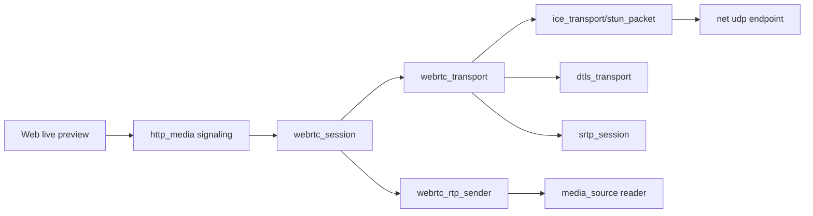

# webrtc

## 命名迁移

本模块命名迁移遵循仓库根目录 `重构.md` 的“任务 1 命名迁移基线”。后续目录、静态库、public header、接口类、Options/Dependencies/Stats、工厂函数和变量名只按该基线迁移；本文件中的旧 `_service`、`stream_*`、`MetaRtc*` 或 `Yang*` 名称仅表示迁移前名称、历史说明或明确允许保留的协议概念。HTTP REST 路径、配置 schema、Web DTO 和 ONVIF 返回路径可以随完全重构同步迁移；变更必须在同一任务内更新调用方、配置样例和文档，不保留旧兼容适配。

## 模块定位

`webrtc` 拥有 native WebRTC peer/session、SDP、STUN/ICE、DTLS、SRTP、RTCP
和 RTP sender。WebRTC 是 video-only sendonly 预览链路，不保留 metaRTC/Yang
后端，也不污染 HLS/FLV 主链路状态。

## 总体框架图

## 核心职责

- 创建和关闭 peer。
- 解析 offer、生成 answer、处理 ICE candidate。
- 管理 ICE、DTLS、SRTP、RTCP 和 selected candidate pair。
- 从 `media_source` reader 获取关键帧优先的视频帧，经 RTP sender 输出 SRTP。
- 暴露状态给 `http_media` signaling handlers。

## 接口归属

public API 在 `webrtc.h`，对外接口名为 `IWebrtc`，工厂函数为 `CreateWebrtc()`。
HTTP signaling 路由和 DTO 归 `http_media`，Web 播放状态归 `www`，媒体 ready
和 reader 生命周期仍归 `media_source`。冻结后的 signaling 路径为：

| API | 语义 |
| --- | --- |
| `POST /api/webrtc/peers` | 创建 peer，输入 `stream`、`client_id`、`session_id` |
| `POST /api/webrtc/peers/{peer_id}/offer` | 提交 SDP offer，返回 SDP answer |
| `POST /api/webrtc/peers/{peer_id}/candidates` | 提交 remote ICE candidate |
| `DELETE /api/webrtc/peers/{peer_id}` | 关闭 peer |

WebRTC 模块只暴露 service/session 能力；JSON envelope、鉴权和路径参数解析归
`http_media`/`http`。

`WebrtcStats` 只暴露 native 链路状态和计数：`enabled`、`signaling_ready`、
`ice_ready`、`dtls_ready`、`srtp_ready`、`selected_ice_pairs`、peer 数、
offer/candidate 数、帧发送/丢弃和 RTP 包发送/丢弃。`ice_ready`、`dtls_ready` 和
`srtp_ready` 表示本地协议栈可用于创建 peer；peer 级 ICE connected/completed 通过
`selected_ice_pairs` 统计观测。模块不再暴露 `BackendName()` 或
`backend_available`。

`WebrtcPeerInfo` / peer diagnostics 字段冻结为：

| 字段 | 语义 |
| --- | --- |
| `peer_id` | peer 标识 |
| `stream` | `main` 或 `sub` |
| `state` | created、offer_received、connecting、connected、closing、closed、failed |
| `ice_selected` | 是否已有 selected ICE pair |
| `dtls_state` | DTLS 状态文本 |
| `srtp_ready` | outbound/inbound SRTP context 是否可用 |
| `rtp_packets` / `rtp_bytes` | 已发送 RTP/SRTP 统计 |
| `last_error` | 最近一次明确失败原因 |
| `created_at_ms` / `updated_at_ms` | peer 生命周期时间戳 |

`/api/media/sessions` 可以聚合这些字段；`/api/media/streams/{stream}` 只展示
protocol ready 汇总，不替代 peer 级 diagnostics。

10.5 当前基线已经移除 metaRTC/Yang include 和链接库，保留 OpenSSL 与 libsrtp；
usrsctp/datachannel 首版不启用。`dtls_transport.*` 负责生成本地自签名证书、输出
SHA-256 fingerprint、执行 DTLS server role 握手、校验 remote fingerprint，并通过
`EXTRACTOR-dtls_srtp` 导出 AES_CM_128_HMAC_SHA1_80 的 SRTP master key/salt。
native engine 在收到 offer 时为 peer 创建独立 UDP host candidate、ICE transport
和 server-role DTLS transport，answer 使用实际绑定端口和同一组 ICE ufrag/pwd。
`webrtc.public_ip` 缺省、为空或为 `"auto"` 时，组合根在启动 WebRTC 前按
`network.default_ifname` 读取设备当前 IPv4，并把解析出的地址写入 SDP/ICE candidate。
多网卡、NAT、VPN 或端口映射部署可以显式填写浏览器真实可达的 IPv4；如果自动解析不
到可用地址，WebRTC 不启动，但不影响 RTSP、HTTP 或其他预览协议。

`IWebrtc::ApplyOptions()` 支持运行态更新 `enabled`、`prefer_tcp`、`max_peers`、
`public_ip` 和 `ice_servers`，新 peer 使用更新后的 SDP/ICE 参数。`enabled=false`
会关闭当前 open peer。`local_port_base` 参与 UDP host candidate 端口分配，运行时
修改会被 app 的 config attachment 拒绝，必须重启后生效。`public_ip="auto"` 的
解析仍由 app 读取 `network.default_ifname` 的当前 IPv4；若网络地址变化但 WebRTC
scope JSON 未变化，后续需要通过 network 事件联动触发重新应用。

10.4 已接入 STUN/ICE 层：`stun_packet.*` 支持 binding request/response、
USERNAME、MESSAGE-INTEGRITY、FINGERPRINT、PRIORITY 和 USE-CANDIDATE；
`ice_transport.*` 绑定 UDP host candidate，校验浏览器 STUN binding request，
回复 XOR-MAPPED-ADDRESS，记录 selected pair，并通过 `selected_ice_pairs` 暴露
已选中的 candidate pair 数。首版不实现 TURN、relay 或 TCP candidate。

UDP 收包先由 STUN/ICE 建立 selected pair，随后 DTLS packet 进入
`webrtc_transport` 持有的 `DtlsTransport`，outgoing handshake packet 通过 selected
pair 发回；握手 timeout 由 `net` timer 重传驱动。DTLS connected 后
`webrtc_transport` 建立 outbound/inbound SRTP context。

10.3 已接入 SDP 层：native engine 可解析浏览器 video offer，并按本地 stream codec
选择同 codec 的 90000Hz payload。H.264 仍要求 `packetization-mode=1`；H.265/HEVC
offer 使用对应 payload 生成 `H265/90000` video-only sendonly answer。answer 包含
`mid`、ICE ufrag/pwd、本地 SHA-256 fingerprint、`setup:passive`、`rtpmap`、`fmtp`、
首版支持的 PLI/FIR `rtcp-fb`、SSRC 和 host candidate。H.265 WebRTC 播放仍依赖
浏览器是否实际提供 HEVC WebRTC 解码能力。

10.6 当前基线已经把 SRTP/RTCP 接入 `webrtc_transport`：RTP sender 交出的 RTP
packet view 会先经 `srtp_session` 加密，再通过 selected ICE pair 发送；入站 SRTCP
会解密并解析 PLI/FIR，触发 `media_source.RequestKeyFrame()`。NACK 和 TWCC 仅保留
反馈类型识别，重传和拥塞控制后置。

10.7 当前基线已经把视频发送路径从旧 push sink 迁移到 `media_source`
`MediaFrameReader`：peer connected 后按连接 attach keyframe-first reader，先发送
启动 GOP，再周期拉取 live frame。`webrtc_rtp_sender.*` 复用
`rtp::RtpPacketizer` 生成 H.264/H.265 RTP packet view，RTP payload type 和
SSRC 使用 SDP answer 中协商出的发送参数，timestamp 使用 `media_source` 修正后的
`MediaFrame` PTS，维护每 peer 的 sequence、首帧关键帧门禁、90k clock rate 校验、
RTP timestamp 单调门禁和 RTP 包/帧统计。drain timer 发送帧时持有 WebRTC engine
共享快照；engine 状态回调和 drain timer 通过同一个 callback guard 进入 service，
避免 service stop/release 与 SRTP 发送并发释放 native transport。peer close、
service stop 或失败时会取消 drain timer、detach reader 并释放启动帧引用。

10.8 当前基线收口 peer/session 生命周期：`WebrtcServiceImpl` 统一编排 peer id、
stream id、pending ICE candidate、reader、drain timer、setup timeout 和 close；
`webrtc_engine` 只做 session 注册、UDP/timer 回调分发、状态回调和 service-facing
接口适配；`webrtc_session` 拥有 offer/answer、SDP 参数和 RTP 发送参数；
`webrtc_transport` 持有 ICE/DTLS/SRTP、UDP endpoint、DTLS timer 和 selected pair。
关闭 peer 时先阻止 reader 继续 drain，等待正在运行的 drain 回调退出，再取消 timer、
detach reader、释放 RTP sender 状态，最后关闭 engine peer 以释放 SRTP/DTLS/ICE；
service release 会先关闭 callback guard 并等待 engine/timer 回调退出，再释放 reader 和
native transport。`http_media` WebRTC handler 只做鉴权、JSON DTO 转换和 create peer、
offer、candidate、close 调用，不持有 ICE/DTLS/SRTP 或 media reader 状态。

10.9 当前基线把 peer diagnostics 落到 public `WebrtcPeerInfo`：service/store 记录
`created_at_ms`、`updated_at_ms` 和 `last_error`，session/transport 回填
`ice_selected`、`dtls_state`、`srtp_ready`、`rtp_packets` 和 `rtp_bytes`。HTTP
DELETE、setup timeout、SDP/DTLS/SRTP 失败和 reader attach 失败都经
`WebrtcServiceImpl` 的 peer close path 收敛，关闭前保存最后一次 transport 诊断，
关闭后保留 peer 的 closed/failed 状态供 HTTP/API 聚合查询。

## 状态与资源模型

WebRTC peer/session 拥有 SDP offer/answer 和 RTP 发送参数；ICE/DTLS/SRTP 状态、
UDP endpoint 和 DTLS timer 归 `webrtc_transport`；RTP sender 和 media reader 归
`WebrtcServiceImpl` 管理。peer 关闭、ICE 失败、DTLS 失败或 HTTP close 时必须按顺序
detach reader、停止 RTP sender、释放 SRTP/DTLS/ICE 和 timer，避免继续持有媒体帧引用。

关闭入口统一为 peer close path：SRTP 初始化失败、DTLS failed、setup timeout、
HTTP DELETE、WHEP DELETE、ICE 异常和 service stop 都不得各自释放一半资源。
`PLI`/`FIR` 必须调用 `media_source.RequestKeyFrame()`；`NACK`/`TWCC` 只识别和记录，
首版不实现重传或拥塞控制。
`net_adaptive` 只通过 public stats/diagnostics 观察 WebRTC 网络压力，不注入
WebRTC 模块，也不替代 PLI/FIR/NACK/TWCC 这类协议反馈。

## 非目标

- 不维护 HLS/FLV/MJPEG ready 或缓存。
- 不由 Web 前端推导 ICE/public IP 或媒体 codec 状态。
- 不实现 audio、datachannel、推流、录制、存储回放或 TURN 首版能力。
- 不保留 metaRTC/Yang 兼容字段、链接库或后端名称 API。

## 风险与优化方向

- WebRTC peer 生命周期必须和 media reader 生命周期绑定。
- ICE/public IP 来自 runtime config；`"auto"` 由 app 通过 network 状态解析，
  不能由 Web 前端推导。
- 失败时只影响 WebRTC 预览，不影响 HLS/FLV/MJPEG。
- SDP/ICE/DTLS/SRTP 的失败路径必须返回明确状态并释放资源；不能依赖异常或 RTTI。
