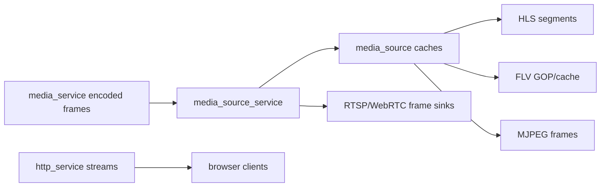

# Memory Optimization Design

## 模块定位

内存优化设计关注视频热路径、浏览器流封装、客户端 fanout 和 Web 预览相关内存峰值。
具体实现归 `media_service`、`media_source`、`media_source_service`、`stream_codec`、
`stream_mux`、`http_service` 和 `webrtc_service`。

## 总体框架图

## 优化原则

- 帧路径避免普通日志、重复分配和不必要 string 拼接。
- HLS/FLV 缓存使用有界数量，客户端数量使用 options 限制。
- 优先传递 slice/view 或引用计数 buffer，只有跨生命周期边界时才复制。
- 时间戳修正、GOP cache、segment cache 归 `media_source`，不要散落在协议层。

## 当前重点

- `media_source`：HLS segment retain、FLV cached tags、GOP cache 和
  `EncodedFrame` 引用释放。
- `media_source_service`：下游 client registry 和 frame sink 数量上限。
- `stream_mux`：封装输出减少临时大 buffer。
- `http_service`：慢客户端断连、stream executor 队列和 socket 写边界。
- `webrtc_service`：peer fanout 和 frame dispatch 内存峰值。

## 风险与优化方向

- 直播客户端数量增加会放大缓存和 socket backpressure。
- H.265/H.264 parameter set 和 keyframe 缓存要随 codec 切换重建。
- 优化前后必须用构建和板端预览验证，避免只降低分配却破坏可播放性。
