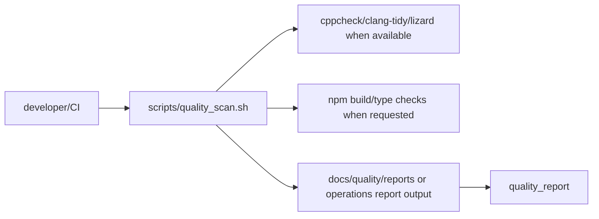

# Quality Tooling Design

## 模块定位

质量工具归 `operations/`，用于嵌入式 C/C++ 和 Web 前端的静态扫描、复杂度观察、
构建验证和报告留存。它不定义业务架构，也不替代模块设计。

## 总体框架图

## 核心职责

- 提供质量扫描入口和工具安装建议。
- 汇总生产代码中的高复杂度、潜在内存、日志、封装和接口风险。
- 保留原始扫描日志，但默认不把大报告目录纳入 git。

## 使用规则

- 普通文档或小 bugfix 不强制运行质量扫描。
- 架构 review、技术债盘点、热路径优化和用户明确要求时运行。
- 扫描结论必须回到拥有模块文档或具体代码任务，不能长期停留在横切报告里。

## 风险与优化方向

- 工具输出有误报，需要结合源码判断。
- 扫描报告不要替代 `make -j2` 或 `npm run build` 的构建验证。
