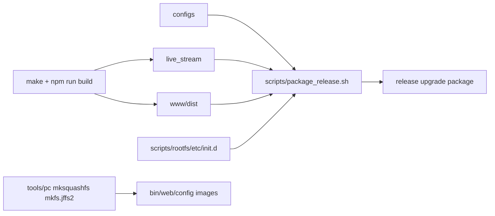

# Release Package Design

## 模块定位

发布包设计覆盖 `scripts/package_release.sh`、`scripts/package_debug.sh`、rootfs
init 脚本、PC 文件系统工具和板端部署布局。升级运行和 SPI NOR 写入见
`../app/upgrade-runtime-design.md`，升级状态机见 `../libs/upgrade-service-design.md`。

## 总体框架图

## 核心职责

- 组织 app binary、动态库、Web 静态资源、配置、公钥和启动脚本。
- 生成适配 32M SPI NOR 分区的 `bin`、`web`、`config` 等镜像或升级包内容。
- 保证 `/opt/app`、`/www`、`/config`、`/data` 和 `/tmp/live_stream/upgrade`
  运行路径与 app 配置一致。

## rootfs 脚本

- `S20mount_app`：挂载 app/web/config/data 等分区。
- `S80live_stream`：启动业务程序，传入生产路径和静态资源根目录。
- `/tmp` 必须是 RAM 路径，升级临时目录不得落在 flash 长期分区。

## 风险与优化方向

- 发布包内容必须和 SPI NOR 分区大小匹配。
- Web 静态资源构建失败不能被旧 dist 掩盖。
- 配置默认值、公钥和认证用户初始化必须保持可恢复。
