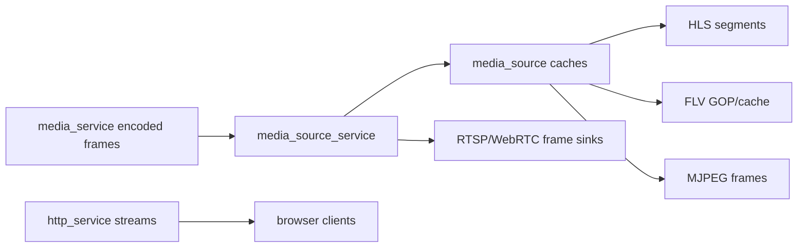

# Memory Optimization

## 模块定位

本专项只记录内存和拷贝优化方向。具体实现仍归拥有模块：
`media_service`、`media_source`、`media_source_service`、`stream_codec`、
`stream_mux`、`http_service` 和 `webrtc_service`。

## 总体框架图

## 优化原则

- 帧路径避免普通日志、重复分配和不必要 string 拼接。
- HLS/FLV 缓存使用有界数量，客户端数量使用 options 限制。
- 优先传递 slice/view 或引用计数 buffer，只有跨生命周期边界时才复制。
- 时间戳修正、GOP cache、segment cache 归 `media_source`，不要散落在协议层。
- 优化结论必须回写拥有模块文档，不能长期停留在专项文档里。

## 当前重点

- `media_source`：HLS segment retain、FLV cached tags、GOP cache 和
  `EncodedFrame` 引用释放。
- `media_source_service`：下游 client registry 和 frame sink 数量上限。
- `stream_mux`：封装输出减少临时大 buffer。
- `http_service`：慢客户端断连、stream executor 队列和 socket 写边界。
- `webrtc_service`：peer fanout 和 frame dispatch 内存峰值。

## 质量验证

- 文档或小 bugfix 不强制运行质量扫描。
- 架构 review、技术债盘点、热路径优化和用户明确要求时运行
  `scripts/quality_scan.sh`。
- 扫描报告只作为输入，结论需要结合源码判断后落到模块文档或具体代码任务。
- 优化前后至少做聚焦构建和板端预览验证，避免只降低分配却破坏可播放性。

## 风险与优化方向

- 直播客户端数量增加会放大缓存和 socket backpressure。
- H.265/H.264 parameter set 和 keyframe 缓存要随 codec 切换重建。
- 临时大 buffer、跨线程队列积压和慢 socket 写是优先排查点。
