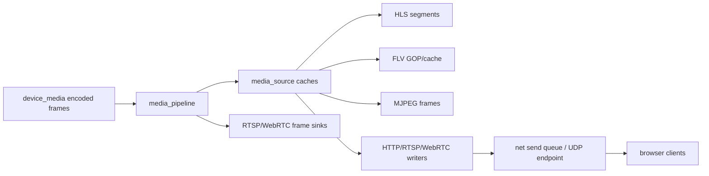

# Memory Optimization

## 模块定位

本专项只记录内存和拷贝优化方向。具体实现仍归拥有模块：
`device_media`、`media_source`、`media_pipeline`、`media_codec`、
`rtp`、`net`、`http` 和 `webrtc`。

## 总体框架图

## 优化原则

- 帧路径避免普通日志、重复分配和不必要 string 拼接。
- HLS/FLV 缓存使用有界数量，客户端数量使用 options 限制。
- 优先传递 slice/view 或引用计数 buffer，只有跨生命周期边界时才复制。
- 时间戳修正、GOP cache、segment cache 归 `media_source`，不要散落在协议层。
- TCP send queue、pending bytes、写 buffer 上限、写 timeout 和慢客户端关闭归
  `net`，协议模块不要各自维护 socket 发送队列。
- 优化结论必须回写拥有模块文档，不能长期停留在专项文档里。

## 当前重点

- `media_source`：HLS segment retain、FLV cached tags、GOP cache、MJPEG latest
  frame 和 `EncodedFrame` 引用释放。
- `media_pipeline`：下游 client registry 和 frame sink 数量上限。
- `media_source`：HLS/FLV 封装输出减少临时大 buffer。
- `rtp`：RTSP/WebRTC RTP packet view 避免复制 media payload。
- `net`：慢客户端断连、TCP pending bytes、send queue 和 UDP endpoint 生命周期。
- `http`：stream executor 队列和 HTTP 业务 session 释放。
- `webrtc`：peer fanout 和 frame dispatch 内存峰值。

## 基线指标

每次热路径优化前后至少记录以下指标，不能只凭代码直觉判断：

| 指标 | 观察点 | 归属模块 |
| --- | --- | --- |
| 进程 RSS / VmHWM | 单客户端、满客户端、慢客户端断连后 | `app` / `http` |
| HLS segment 数量和 body 总量 | playlist depth + retain count 是否有界 | `media_source` |
| FLV cached tag / GOP 数量 | 新客户端起播缓存是否随 GOP 上限收敛 | `media_source` |
| 活跃 FLV/MJPEG/frame sink 数 | 是否受 `MediaPipelineOptions` 限制 | `media_pipeline` |
| TCP active connections / pending bytes | 慢 socket 是否堆积到 `send_buffer_limit_bytes` 后断开 | `net` |
| TCP slow close count / close reason | 队列满、send stall、读写 timeout 是否可区分 | `net` |
| WebRTC peer 数和帧 fanout | peer 增加时是否线性放大持帧时间 | `webrtc` |

当前资源上限以 `MediaPipelineOptions`、`HttpOptions` 和 WebRTC options
为准；socket 写侧统一落到 `TcpListenOptions` 的 `send_queue_capacity`、
`send_buffer_limit_bytes`、`send_stall_timeout_ms`、`read_timeout_ms` 和
`write_timeout_ms`。新增缓存或队列时必须先定义上限，再补拥有模块文档。

## 验收口径

- 单路主码流 + 子码流预览时，HLS/FLV/MJPEG/WebRTC 任一模式启停后资源应回落到稳定值。
- 客户端达到上限时，新连接失败必须可解释，不能突破 registry 或 HTTP connection 上限。
- 慢客户端断开后，`net` send queue、stream executor backlog 和媒体缓存引用必须释放。
- codec 在 H.264/H.265/MJPEG 间切换后，旧 parameter set、GOP cache 和 segment cache
  不得继续服务新客户端。
- 时间戳回退或大跳变后，GOP、HLS、FLV、MJPEG latest frame 和 reader live queue
  必须按 reset reason 回落，后续客户端从新的可解码点开始。
- 优化结果必须同步回拥有模块文档；专项文档只保留跨模块指标和排查入口。

## 质量验证

- 文档或小 bugfix 不强制运行质量扫描。
- 架构 review、技术债盘点、热路径优化和用户明确要求时运行
  `python3 scripts/quality_scan.py`。
- 扫描报告只作为输入，结论需要结合源码判断后落到模块文档或具体代码任务。
- 优化前后至少做聚焦构建和板端预览验证，避免只降低分配却破坏可播放性。

## 风险与优化方向

- 直播客户端数量增加会放大缓存和 socket backpressure。
- H.265/H.264 parameter set 和 keyframe 缓存要随 codec 切换重建。
- 临时大 buffer、跨线程队列积压、`NetBufferOwner` 持帧时间和慢 socket 写是优先排查点。
- 配置运行态联动仍需补 `network` 事件订阅或多 attachment 机制，让
  `network.advertise_ip`、`network.default_ifname` 和 WebRTC auto public IP 变化能
  驱动协议 URL/SDP 重新应用，而不抢占 `network_config` 的配置 apply 回调。
