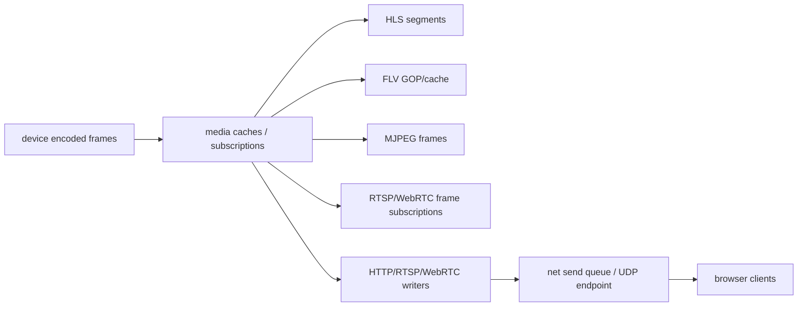

# Memory Optimization

## 模块定位

本专项只记录内存和拷贝优化方向。具体实现仍归拥有模块：
`device`、`media`、`media_codec`、`net`、`http` 和 `webrtc`。

## 总体框架图

Draw.io 源文件：[video-pipeline-memory.drawio](video-pipeline-memory.drawio)。

## 视频热路径链路

主码流和子码流走同一套热路径，只是 `StreamId`、VENC channel、缓存状态和
client/subscription 计数分开维护。下游协议不能直接订阅 HiSilicon SDK；必须通过
`device -> media` 这条链路消费同一份归一化编码帧。

1. `hisi_vendor` 通过 `HI_MPI_VENC_GetStream` 取到 VENC pack。pack 数据仍归 MPP
   stream buffer 管理，`HI_MPI_VENC_ReleaseStream` 后不能继续引用。
2. `hisi_vendor` 把一个 VENC frame 的多个 pack、以及环形 buffer 回绕后的
   first/second slice，按原始 AnnexB 顺序拼成项目自己的连续 `MediaBuffer`。
   这是进入项目内存的必要 payload 深拷贝点。
3. `device` 用 `MediaFrame` 描述 `MediaBufferRef payload + codec + pts/dts +
   frame_type`，通过 `FrameSink::PushFrame()` 分发给 `media`。后续保存帧只做
   `MediaFrame` 值拷贝，增加底层 `MediaBuffer` 引用计数，不复制整帧。
4. `media` 归一化时间戳，解析 H.264/H.265 AnnexB NAL 视图，写入 GOP cache、
   FrameSubscription live queue、FLV cache、HLS segment 和 MJPEG latest frame。
5. `media` 统一维护 corrected DTS/PTS、参数集、GOP、frame subscription、
   HLS playlist/segment、FLV sequence header 和 ready 状态。codec 切换、
   stream stop、时间戳回退或大跳变都会重建这些缓存。
6. `http_media`、`rtsp`、`webrtc` 只消费 `media` 暴露的 FrameSubscription、
   FLV tag view 或 HLS segment ref，并把带 owner 的 slice 交给 `http/net` 发送。

## 设计考量

- VENC pack 生命周期由 MPP 驱动控制，不能把 pack 指针直接传给异步协议层；
  先复制到项目 `MediaBuffer` 后即可尽早 `ReleaseStream`，避免硬件码流 buffer
  被 Web 慢客户端反压拖住。
- `MediaBuffer` 是编码 payload 的唯一 owner。GOP cache、subscription queue、
  HTTP-FLV cache、RTSP TCP queue 和 HTTP response queue 都通过引用计数保活，
  避免按协议数、客户端数或 GOP 数量重复复制大帧。
- HLS 是独立 HTTP 对象和 MPEG-TS 转封装结果，segment 必须自包含，不能保存原始
  `MediaFrame` payload 指针。因此 HLS 主动把 PES header、TS packet header 和
  NAL payload 写入独立 segment body。
- FLV 和 RTP 是流式发送格式，可以把协议小头部和原始 NAL payload 分成 slices。
  小头部可复制入 socket 队列，媒体 payload 通过 `MediaOutSlice.buffer` /
  `NetBufferSlice.buffer` 延长 `MediaBuffer` 生命周期。
- WebRTC RTP 分包阶段仍使用 slice view；SRTP 加密阶段必须形成可原地加密并追加
  认证尾部的连续 UDP packet，所以会有每个 RTP packet 的加密前复制。
- 慢客户端、pending bytes、send queue 上限和关闭策略归 `net/http`，媒体模块只持有
  有界缓存和 subscription/client registry，不在协议层各自堆积 socket buffer。

## Payload 拷贝次数

下表只统计视频 payload 大块拷贝；协议 header、NAL length、HTTP header、RTP/FU
header、FLV timestamp rebase 等小块复制单独说明。内核协议栈从用户态到 socket/网卡
的复制不在本表统计范围内。

| 阶段 | Payload 深拷贝次数 | 说明 |
| --- | ---: | --- |
| VENC pack -> `MediaBuffer` | 1 | 必要拷贝。把 MPP pack 和回绕 slice 拼成连续 AnnexB payload，随后释放 VENC stream。 |
| `device` 分发 | 0 | `MediaFrame` 值拷贝只增加底层 `MediaBuffer` 引用计数，不持有 GOP 或最近关键帧缓存。 |
| `media` ingest / parse / cache | 0 | NAL parser、GOP cache 和 FrameSubscription live queue 引用同一份 payload；NAL list 只是指针视图，不按 subscription 或 GOP 复制 payload。新订阅方 keyframe-first 从 `media` 缓存起播。 |
| HLS 封装 | 1 | `HlsMaker` 把 PES/TS header、AnnexB 起始码和 NAL payload 写入独立 TS segment body。segment 扩容时可能复制已写 segment body，当前实现会预估并预留容量降低扩容概率。 |
| HLS HTTP 发送 | 0 | TS segment 已在 `MediaBuffer` 中，`SendResponseSlices()` 用 owner 让 net 队列保活。 |
| HTTP-FLV live/cache | 0 | FLV tag header、NAL length 和 previous tag size 是小块；视频 NAL payload slice 指向原 `MediaBuffer`。 |
| RTSP RTP packetize | 0 | `RtpPacketizer` 生成 RTP header/FU header slice，媒体 payload 仍指向原帧。TCP interleaved 用 `MediaBufferRef` 保活，UDP 在调用内发送。 |
| WebRTC RTP packetize | 0 | 与 RTSP 一样，RTP packet view 不复制媒体 payload。 |
| WebRTC SRTP protect | 1/packet | libsrtp 需要连续可写 buffer；每个 RTP packet view 会复制成连续 buffer 后原地加密并追加认证尾部。 |
| `net` TCP send queue | 0 或小块复制 | 带 `MediaBufferRef` 的媒体 slice 不复制；无 buffer 的栈上 header、小字符串会复制到 inline/heap out buffer。 |

## 协议封装与分包

### HLS / MPEG-TS

- 输入是 H.264/H.265 AnnexB NAL 视图，输出是独立 `.ts` segment body。
- segment 只在关键帧边界开始和切分；关键帧前的 P/B 帧不会进入首个 segment。
- H.264 关键帧缺 SPS/PPS、H.265 关键帧缺 VPS/SPS/PPS 时，会在 segment 边界前置
  已缓存参数集，保证从 segment 接入的浏览器可以解码。
- `AppendTsPayloadToBuffer()` 把 PES header、TS 188 字节包、连续计数和 NAL payload
  写进 segment body。playlist 只暴露 finalized segment，半成品 segment 不对外服务。

### HTTP-FLV

- 新客户端先收到 HTTP streaming header、FLV file header、sequence header，再从
  cached GOP 的关键帧起点进入 live tag。
- H.264 sequence header 使用 AVCDecoderConfigurationRecord；H.265 使用 enhanced
  FLV 的 `hvc1` sequence header。
- coded frame tag 由 FLV tag header、video tag header、4 字节 NAL length、NAL
  payload slice 和 previous tag size 组成。SPS/PPS/VPS/AUD 不重复写入 coded frame。
- 每个 HTTP-FLV 连接会把 timestamp rebase 到从 0 开始；只复制第一个小 header
  来重写 timestamp，payload 仍通过 owner 引用原帧。

### RTSP / RTP

- RTP 时间戳使用 90kHz clock，由 corrected PTS 转换得到；sequence number 按 session
  维护。
- 单个 NAL 加 RTP header 后不超过 MTU 时直接作为一个 RTP packet。
- H.264 超 MTU 使用 FU-A：RTP header + 2 字节 FU indicator/header + NAL 剩余 payload。
- H.265 超 MTU 使用 FU：RTP header + 3 字节 FU payload header + NAL 剩余 payload。
- TCP transport 使用 RTSP interleaved framing：`$ + channel + length + RTP packet`；
  UDP transport 直接把 RTP slices 聚合为 datagram 发送。

### WebRTC / RTP / SRTP

- WebRTC 复用 RTP packetizer，但 payload type、SSRC、clock rate 来自 SDP/peer 运行态。
- peer 未见关键帧时丢弃非关键帧，subscription 溢出后也等待下一个关键帧恢复。
- RTP packet view 进入 `SrtpSession::ProtectRtp()` 后，会复制成连续 buffer，libsrtp
  原地加密并追加认证尾部，再通过 ICE selected pair 的 UDP socket 发送。
- WebRTC 的额外拷贝是加密所需，不会长期保存原始 `MediaFrame` 指针。

## 优化原则

- 帧路径避免普通日志、重复分配和不必要 string 拼接。
- HLS/FLV/GOP/shared live frame 使用 `MediaCacheLimits` 控制运行期数量和
  字节上限，客户端数量继续使用 `MediaStreamsOptions` 的 client/subscription 上限。
- 优先传递 slice/view 或引用计数 buffer，只有跨生命周期边界时才复制。
- 时间戳修正、GOP cache、segment cache 归 `media`，不要散落在协议层。
- TCP send queue、pending bytes、写 buffer 上限、写 timeout 和慢客户端关闭归
  `net`，协议模块不要各自维护 socket 发送队列。
- 优化结论必须回写拥有模块文档，不能长期停留在专项文档里。

## 当前重点

- `media`：HLS segment retain、FLV cached tags、GOP cache、MJPEG latest
  frame、shared live frame 和 `MediaFrame` 引用释放。
- `media`：下游 client registry 和 frame subscription 数量上限。
- `media`：HLS/FLV 封装输出减少临时大 buffer。
- `media_codec`：RTSP/WebRTC RTP packet view 避免复制 media payload。
- `net`：慢客户端断连、TCP pending bytes、send queue 和 UDP endpoint 生命周期。
- `http`：stream executor 队列和 HTTP 业务 session 释放。
- `webrtc`：peer fanout 和 frame dispatch 内存峰值。

## 基线指标

每次热路径优化前后至少记录以下指标，不能只凭代码直觉判断：

| 指标 | 观察点 | 归属模块 |
| --- | --- | --- |
| 进程 RSS / VmHWM | 单客户端、满客户端、慢客户端断连后 | `app` / `http` |
| HLS segment 数量和 body 总量 | `max_hls_segments`、`max_hls_segment_bytes`、`max_hls_cached_bytes` 是否生效 | `media` |
| FLV cached tag / GOP 数量 | `max_flv_cached_tags`、`max_flv_cached_bytes` 是否让新客户端起播缓存收敛 | `media` |
| Shared live frame cache | `max_shared_frames`、`max_shared_bytes` 触顶后慢客户端是否等待关键帧恢复 | `media` |
| 活跃 FLV/MJPEG/frame subscription 数 | 是否受 `MediaStreamsOptions` 限制 | `media` |
| TCP active connections / pending bytes | 慢 socket 是否堆积到 `send_buffer_limit_bytes` 后断开 | `net` |
| TCP slow closes / close reason | 队列满、send stall、读写 timeout 是否可区分 | `net` |
| WebRTC peer 数和帧 fanout | peer 增加时是否线性放大持帧时间 | `webrtc` |

当前资源上限以 `MediaStreamsOptions::cache_limits`、`MediaStreamsOptions` 的
client/subscription 上限、`HttpOptions` 和 WebRTC options 为准；socket 写侧统一落到
`TcpListenOptions` 的 `send_queue_capacity`、`send_buffer_limit_bytes`、
`send_stall_timeout_ms`、`read_timeout_ms` 和 `write_timeout_ms`。新增缓存或队列时必须
先定义上限，再补拥有模块文档。

`MediaStreamStats::cached_bytes` 汇总 media 内 GOP、HLS segment 和 FLV GOP cache 的
当前字节近似值；`main_hls_cached_bytes`、`sub_hls_cached_bytes`、
`main_flv_cached_bytes`、`sub_flv_cached_bytes` 和 client frame/cache drop 计数用于
定位触顶来源。HTTP/Web 控制面可以继续读取旧 `cached_bytes` 字段，细分字段先作为 C++
统计契约保留。

## 验收口径

- 单路主码流 + 子码流预览时，HLS/FLV/MJPEG/WebRTC 任一模式启停后资源应回落到稳定值。
- 客户端达到上限时，新连接失败必须可解释，不能突破 registry 或 HTTP connection 上限。
- 慢客户端断开后，`net` send queue、stream executor backlog 和媒体缓存引用必须释放。
- codec 在 H.264/H.265/MJPEG 间切换后，旧 parameter set、GOP cache 和 segment cache
  不得继续服务新客户端。
- 时间戳回退或大跳变后，GOP、HLS、FLV、MJPEG latest frame 和 subscription live queue
  必须按 reset reason 回落，后续客户端从新的可解码点开始。
- 优化结果必须同步回拥有模块文档；专项文档只保留跨模块指标和排查入口。

## 质量验证

- 文档或小 bugfix 不强制运行质量扫描。
- 架构 review、技术债盘点、热路径优化和用户明确要求时运行
  `python3 scripts/scan/quality_scan.py`。
- 扫描报告只作为输入，结论需要结合源码判断后落到模块文档或具体代码任务。
- 优化前后至少做聚焦构建和板端预览验证，避免只降低分配却破坏可播放性。

## 风险与优化方向

- 直播客户端数量增加会放大缓存和 socket backpressure。
- H.265/H.264 parameter set 和 keyframe 缓存要随 codec 切换重建。
- 临时大 buffer、跨线程队列积压、`MediaBufferRef` 持帧时间和慢 socket 写是优先排查点。
- 配置运行态联动仍需补 `network` 事件订阅或多 attachment 机制，让
  `network.advertise_ip`、`network.default_ifname` 和 WebRTC auto public IP 变化能
  驱动协议 URL/SDP 重新应用，而不抢占 `system.network` 的配置 apply 回调。
