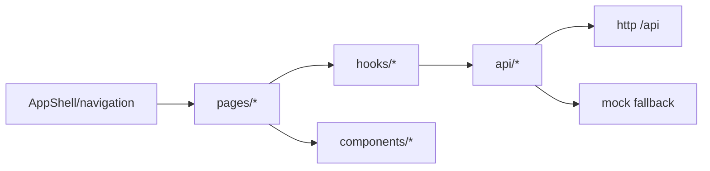

# Web Console Design

## 模块定位

`www/` 是 IPC/NVR 管理台，使用 Vite、React、TypeScript 和 plain CSS/CSS
variables。它负责页面布局、表单交互、预览视图、状态展示和 mock fallback；
不解析 HiSilicon SDK 配置，不拥有后端配置语义。

## 总体框架图



## 页面分组

- 登录和认证：`LoginPage`、`ChangePasswordPage`、`AuthContext`。
- 实时预览：`LiveViewPage`、`VideoPreview`、AI 叠框和播放 hooks。
- 视频/图像/抓图/叠加：配置表单、能力字段、遮挡编辑器和状态面板。
  视频参数页的 ROI 编码区域在右侧实时预览上拖拽添加或重画，表格保留像素坐标、
  QP 和绝对/相对模式微调。ROI、隐私遮挡和 AI 周界区域共用
  `VideoRegionDrawLayer` 处理预览内容区、指针坐标和矩形渲染。
- 网络/系统/升级：网络配置、系统概览、独立模块状态、升级上传校验和进度。
- 日志和 AI 告警：操作日志查询导出、AI 告警图片瀑布流。

## UI 约束

- 保持管理台风格：紧凑左侧导航、密集表单、深色预览区域和明确状态。
- 不做营销页、装饰大图或设备管理无关内容。
- 页面只展示后端返回的状态，不根据 SDK 字段推导设备内部状态。
- 后端不可用时保留 mock 数据路径，保证 UI 开发和布局验证。

## 参考项目经验

`my_video` 的页面演进说明，IPC Web Console 的价值不是把所有调试项平铺出来，而是让现场
人员先判断设备、媒体、协议和浏览器分别处在哪个状态。`www` 后续页面调整遵循：

- 首屏优先展示实时预览、当前码流、分辨率、帧率、连接状态和最近错误；配置入口按图像、
  视频编码、OSD/隐私遮挡、网络预览、AI、系统维护分组。
- 页面必须区分“当前已生效状态”“用户正在编辑的待提交值”“提交中状态”和“提交失败原因”；
  旧错误在用户修改输入、切换目标或重新提交时清理。
- 调试项默认下沉到诊断区域，例如 RTSP URL、媒体 session、pending bytes、WebRTC peer、
  keyframe 时间和最近 reset reason。
- 播放状态按后端字段呈现：设备是否 running、track 是否 ready、协议是否 ready、浏览器播放器
  是否已经首帧；Web 不用单个 loading 或 success 覆盖这些不同阶段。
- mock fallback 只服务 UI 开发，不成为 schema 或设备状态的权威来源。

## 状态来源

Web 页面只把 HTTP API 返回值作为状态来源。配置语义、设备运行态、媒体 ready、
升级阶段和 AI 结果都归后端拥有模块；Web 只展示、提交用户动作和处理不可用状态。
系统维护页内的“模块状态”只展示 `/api/system/status` 返回的后端模块注册和启动
状态；码流信息页只展示 `/api/media/streams`、`/api/media/sessions` 和播放 URL
返回的媒体运行诊断，两者不得互相推导。
实时预览状态字段在“实时预览”章节集中说明。

## API 消费

前端 API 层负责把 Web Console 的页面动作转成 HTTP 请求，并把响应映射为
TypeScript DTO。后端 API 的语义归 `http` 和对应业务模块，前端只消费。

```mermaid
flowchart LR
  Pages[pages/hooks] --> DomainApi[api/video image stream system ...]
  DomainApi --> Client[api/client.ts]
  Client --> Backend[/api]
  DomainApi --> Types[api/types.ts]
  DomainApi --> Mock[api/mock.ts]
```

API 分组：

- Auth：login、logout、change password、current user。
- Config：video、image、overlay、network、snapshot、AI。
- Media：stream info、preview URLs、session info。
- System/operations：system overview、module status、upgrade、operation logs。
- WebRTC signaling：RESTful peer、offer、candidate、DELETE close。

DTO 规则：

- `www/src/api/types.ts` 描述 Web 消费字段，不描述隐藏 SDK 内部结构。
- 字段新增、删除或语义变更必须同步后端 handler、前端 API、`www/README.md`
  和拥有模块设计文档。冻结 DTO 名称是 `MediaStreamInfo`、
  `MediaPreviewUrls`、`MediaSessionInfo` 和 `WebrtcPeerInfo`。
- 前端不补齐后端缺失状态；缺字段应走兼容默认值或显示不可用状态。

所有 JSON API 使用 `{ ok, data, error, request_id }` envelope。前端 API client
统一解析 envelope；页面只消费 `data` 或展示 `error.code`、`error.message` 和
`request_id`。错误码由后端冻结，前端不得发明本地业务错误码替代后端语义。

WebRTC signaling 响应使用 native 状态模型。`POST /api/webrtc/peers`、
`POST /api/webrtc/peers/{peer_id}/offer`、
`POST /api/webrtc/peers/{peer_id}/candidates` 和
`DELETE /api/webrtc/peers/{peer_id}` 都返回 envelope；peer/offer 响应在 `data`
里返回 `peer_id` 和 `state`，offer 成功时返回 video-only sendonly SDP answer。
SDP answer 可生成不代表 WebRTC 已可播放；播放状态必须等后端 runtime 和 peer
info 确认。offer 失败时前端只展示后端 `error`，不伪造播放。

认证状态由 `AuthContext` 管理。工厂密码路径只允许初始设置，后端返回
`must_change_password` 时 Web 必须先完成改密再进入管理台。HTTP 错误处理应在
API client 层统一转换，页面只负责显示业务含义明确的状态。
媒体 URL、AI 告警图片和操作日志导出 URL 依赖同源 `HttpOnly` session cookie
鉴权；前端不得把 session token 存入 JavaScript 可读存储，也不得把 access token
拼进 URL query。

mock 只用于后端不可用时的 UI 开发和交互验证。mock 数据不得成为真实设备状态或
API schema 的权威来源。

## 实时预览

Web 实时预览负责选择 WebRTC、HLS、HTTP-FLV、MJPEG 或 snapshot 路径，显示播放
状态和 AI 叠框。它不拥有媒体 pipeline，不计算 ready 状态，只消费后端 HTTP API。

```mermaid
flowchart LR
  LiveView[LiveViewPage] --> Metadata[usePreviewMetadata]
  LiveView --> Session[usePreviewLiveSession]
  Session --> Player[usePreviewPlayer]
  Player --> WebRTC[WebRTC signaling]
  Player --> HLS[/live/{stream}/hls]
  Player --> FLV[/live/{stream}.live.flv]
  Player --> MJPEG[/live/{stream}.mjpg]
  Player --> Snapshot[/snapshot/{stream}.jpg]
  Metadata --> Runtime[/api/media/streams]
  Metadata --> URLs[/api/media/streams/{stream}/urls]
  LiveView --> Ai[useAiStatus / overlay]
```

预览模式：

- WebRTC：低延迟预览，信令通过 `/api/webrtc/peers` 及其 peer 子路径。
- HLS：浏览器兼容分段播放，通过后端返回的 `/live/{stream}/hls/index.m3u8`。
- HTTP-FLV：连续直播，通过后端返回的 `/live/{stream}.live.flv`。
- MJPEG：multipart JPEG，通过后端返回的 `/live/{stream}.mjpg`。
- snapshot：静态抓图，通过后端返回的 `/snapshot/{stream}.jpg`。

实时预览的播放状态权威来源是 `GET /api/media/streams` 和
`GET /api/media/streams/{stream}`。前端使用：

- `available`
- `running`
- `codec`
- `resolution` / `fps` / `bitrateKbps`
- `hlsSupported` / `hlsReady`
- `httpFlvSupported` / `httpFlvReady`
- `mjpegSupported` / `mjpegReady`
- `webrtcSupported` / `webrtcReady`
- `active_subscriptions` / `preview_clients`
- `lastDts`
- `lastKeyframeRequestMs` / `lastKeyframeSeenMs`
- `lastFirstFrameMs` / `lastProtocolReadyMs`
- `lastResetReason`

Web 通过 `GET /api/events` 订阅后端 SSE 事件，并在媒体状态变化时立即刷新
`GET /api/media/streams`；轮询只作为事件流不可用时的兜底。协议自动选择优先使用
WebRTC、HTTP-FLV、MJPEG，HLS 作为高延迟浏览器兼容兜底，不抢占低延迟协议。

`webrtcReady` 只有在后端确认 WebRTC 已启用且 native signaling、ICE、DTLS 和
SRTP 均 ready 时才为 true；单独 signaling 可用不代表浏览器可播放。
WebRTC 播放创建 `RTCPeerConnection` 时消费 `/api/config/webrtc` 的 `ice_servers`；
`public_ip` 和 UDP 端口可达性仍由后端 SDP/ICE candidate 和现场网络负责。外网直连
场景需要 HTTP/HTTPS 信令入口以及 `webrtc.local_port_base` 起始的 UDP 端口段对浏览器
可达；CGNAT 或对称 NAT 场景需要 VPN、TURN relay 或云端中继，不能只靠 Web 页面兜底。

播放 URL 只来自 `GET /api/media/streams/{stream}/urls`。Web 不再本地拼接
RTSP、HLS、HTTP-FLV、MJPEG、snapshot 或 WHEP URL，也不消费旧
`/api/status/streams`、`/api/hls`、`/api/flv`、`/api/mjpeg` 路径。

实时预览页轮询 `/api/ai/status`。只有检测结果来自当前码流且坐标有效时，Web 才把
`tasks[].last_result.detections` 合并叠加到视频内容区域。AI 未启用、后端不可用或
结果来自其他码流时，只显示状态，不阻塞预览。
AI 配置页暴露四类任务独立开关，以及检测码流、全局灵敏度、推理频率、结果上限和
报警持续时间下拉项；任务可用性、模型要求、后端、码流和参数范围来自
`/api/ai/status.capabilities` 或 `GET /api/ai/capabilities`，前端不本地硬编码
AI 能力。提交时由前端按后端可用任务开关自动派生后端 `ai.enabled` 运行闸门，并将
共享检测参数保存到各任务配置。周界 `perimeter_regions` 通过实时视频上的矩形绘制
编辑；周界命中和告警联动都由后端 `ai` 模块判断。
AI 页面采用预览优先布局：左侧是实时预览、汇总状态、四类任务开关和周界画框，
右侧是 `/api/ai/alerts` 最新 10 张抓图卡片列表。系统报警触发状态来自
`GET /api/alarm/status`，页面同时监听 `/api/events` 的 `alarm_on` 和 `alarm_off` 事件刷新
告警状态和抓拍列表。

播放器失败时只切换当前播放状态或允许用户选择其他模式，不反向修改后端配置。
后端 ready=false 时前端显示不可用，不自行请求关键帧或猜测编码器状态。

## 系统维护与升级

系统维护页使用页签分离“系统概览”“模块状态”和“固件升级”。系统概览只展示资源、
设备型号和固件版本；模块状态独立展示后端模块的 running/pending/error，不和媒体
subscription、client 或协议 ready 合并。

固件升级 UI 按流程展示：当前升级状态、选择升级包、上传并校验、升级选项、开始升级
/ 取消 / 确认重启、已校验包信息。上传校验和开始写入是两个独立动作；Web 不把上传
成功显示成写 flash 完成。取消按钮只在后端状态允许的阶段启用，提交和等待重启阶段
显示为不可取消。

升级页面按展示语义区分动作反馈、任务状态、风险提示和连接恢复提示。校验通过显示
成功态；写入、提交和等待重启显示风险态；重启或服务恢复窗口显示信息态，不把重启中
直接显示成最终成功。后端 `current_stage` 可作为阶段详情展示，但页面主阶段文案应映射
为中文业务标签。

系统分区升级期间，`live_stream` 会停止并由 `live_sysupgrade` 临时接管同源
`/api/upgrade/status`。Web 仍按同一个接口轮询，不读取本地文件，也不把连接短暂中断
解释为失败；只有后端返回 `failed` 或启动动作明确失败时才显示失败态。

## 非目标

- 不维护设备 SDK 配置解析逻辑。
- 不新增音频、录像、回放相关 UI。
- 不把 Web 状态写成后端状态的替代来源。
