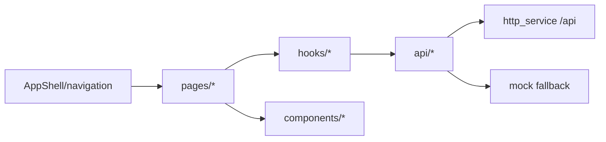

# Web Console Design

## 模块定位

`www/` 是 IPC/NVR 管理台，使用 Vite、React、TypeScript 和 plain CSS/CSS
variables。它负责页面布局、表单交互、预览视图、状态展示和 mock fallback；
不解析 HiSilicon SDK 配置，不拥有后端配置语义。

## 总体框架图

## 页面分组

- 登录和认证：`LoginPage`、`ChangePasswordPage`、`AuthContext`。
- 实时预览：`LiveViewPage`、`VideoPreview`、AI 叠框和播放 hooks。
- 视频/图像/抓图/叠加：配置表单、能力字段、遮挡编辑器和状态面板。
- 网络/系统/升级：设备状态、网络配置、升级上传和进度。
- 日志和 AI 告警：操作日志查询导出、AI 告警图片瀑布流。

## UI 约束

- 保持管理台风格：紧凑左侧导航、密集表单、深色预览区域和明确状态。
- 不做营销页、装饰大图或设备管理无关内容。
- 页面只展示后端返回的状态，不根据 SDK 字段推导设备内部状态。
- 后端不可用时保留 mock 数据路径，保证 UI 开发和布局验证。

## 状态来源

Web 页面只把 HTTP API 返回值作为状态来源。直播可用性使用
`GET /api/status/streams` 的 `browserCodec`、`hlsReady`、`flvReady`、
`mjpegReady`、`webrtcReady` 等字段。媒体能力使用 `GET /api/media/capabilities`。

## 非目标

- 不维护设备 SDK 配置解析逻辑。
- 不新增音频、录像、回放相关 UI。
- 不把 Web 状态写成后端状态的替代来源。
