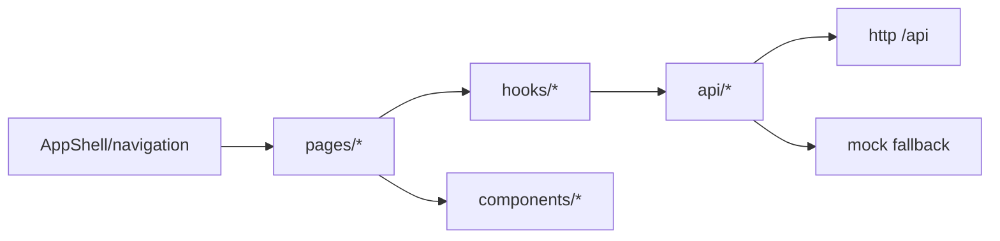

# Web Console Design

## 模块定位

`www/` 是 IPC/NVR 管理台，使用 Vite、React、TypeScript 和 plain CSS/CSS
variables。它负责页面布局、表单交互、预览视图、状态展示和 mock fallback；
不解析 HiSilicon SDK 配置，不拥有后端配置语义。

## 总体框架图



## 页面分组

- 登录和认证：`LoginPage`、`ChangePasswordPage`、`AuthContext`。
- 实时预览：`LiveViewPage`、`VideoPreview`、AI 叠框和播放 hooks。
- 视频/图像/抓图/叠加：配置表单、能力字段、遮挡编辑器和状态面板。
- 网络/系统/升级：设备状态、网络配置、升级上传和进度。
- 日志和 AI 告警：操作日志查询导出、AI 告警图片瀑布流。

## UI 约束

- 保持管理台风格：紧凑左侧导航、密集表单、深色预览区域和明确状态。
- 不做营销页、装饰大图或设备管理无关内容。
- 页面只展示后端返回的状态，不根据 SDK 字段推导设备内部状态。
- 后端不可用时保留 mock 数据路径，保证 UI 开发和布局验证。

## 状态来源

Web 页面只把 HTTP API 返回值作为状态来源。配置语义、设备运行态、媒体 ready、
升级阶段和 AI 结果都归后端拥有模块；Web 只展示、提交用户动作和处理不可用状态。
实时预览状态字段在“实时预览”章节集中说明。

## API 消费

前端 API 层负责把 Web Console 的页面动作转成 HTTP 请求，并把响应映射为
TypeScript DTO。后端 API 的语义归 `http` 和对应业务模块，前端只消费。

```mermaid
flowchart LR
  Pages[pages/hooks] --> DomainApi[api/video image stream system ...]
  DomainApi --> Client[api/client.ts]
  Client --> Backend[/api]
  DomainApi --> Types[api/types.ts]
  DomainApi --> Mock[api/mock.ts]
```

API 分组：

- Auth：login、logout、change password、current user。
- Config：video、image、overlay、network、snapshot、AI。
- Media/status：capabilities、stream status、snapshot、HLS、FLV、MJPEG。
- System/operations：system status、upgrade、operation logs。
- WebRTC signaling：peer、offer、candidate、close。

DTO 规则：

- `www/src/api/types.ts` 描述 Web 消费字段，不描述隐藏 SDK 内部结构。
- 字段新增、删除或语义变更必须同步后端 handler、前端 API、`www/README.md`
  和拥有模块设计文档。
- 前端不补齐后端缺失状态；缺字段应走兼容默认值或显示不可用状态。

WebRTC signaling 响应使用 native 状态模型。`POST /api/webrtc/peers`、offer、
candidate 和 close 都返回 `ok`，失败时返回 `error`；peer/offer 响应同时返回
`peer_id` 和 `state`，offer 成功时才返回 `sdp`。当前 10.1/10.2 native 基线尚未
生成可播放 SDP，offer 失败会返回 `sdp_not_ready`，前端只展示该状态，不伪造播放。

认证状态由 `AuthContext` 管理。工厂密码路径只允许初始设置，后端返回
`must_change_password` 时 Web 必须先完成改密再进入管理台。HTTP 错误处理应在
API client 层统一转换，页面只负责显示业务含义明确的状态。

mock 只用于后端不可用时的 UI 开发和交互验证。mock 数据不得成为真实设备状态或
API schema 的权威来源。

## 实时预览

Web 实时预览负责选择 WebRTC、HLS、HTTP-FLV、MJPEG 或 snapshot 路径，显示播放
状态和 AI 叠框。它不拥有媒体 pipeline，不计算 ready 状态，只消费后端 HTTP API。

```mermaid
flowchart LR
  LiveView[LiveViewPage] --> Metadata[usePreviewMetadata]
  LiveView --> Session[usePreviewPlaybackSession]
  Session --> Player[usePreviewPlayer]
  Player --> WebRTC[WebRTC signaling]
  Player --> HLS[/api/hls]
  Player --> FLV[/api/flv]
  Player --> MJPEG[/api/mjpeg]
  Player --> Snapshot[/api/snapshot]
  Metadata --> Status[/api/status/streams]
  LiveView --> Ai[useAiStatus / overlay]
```

预览模式：

- WebRTC：低延迟预览，信令通过 `/api/webrtc/*`。
- HLS：浏览器兼容分段播放，通过 `/api/hls/{stream}/index.m3u8`。
- HTTP-FLV：连续直播，通过 `/api/flv/{stream}.flv`。
- MJPEG：multipart JPEG，通过 `/api/mjpeg/{stream}.mjpg`。
- snapshot：静态抓图，通过 `/api/snapshot/{stream}.jpg`。

实时预览的播放状态权威来源是 `GET /api/status/streams`。前端使用：

- `browserCodec`
- `hlsSupported` / `hlsReady`
- `flvSupported` / `flvReady`
- `mjpegSupported` / `mjpegReady`
- `webrtcReady`

`webrtcReady` 只有在后端确认 WebRTC 已启用且 native signaling、ICE、DTLS 和
SRTP 均 ready 时才为 true；单独 signaling 可用不代表浏览器可播放。

能力字段来自 `GET /api/media/capabilities`，例如 stream 是否 available 或是否支持
smart codec。能力不是运行状态，不能替代 `ready` 字段。

实时预览页轮询 `/api/ai/status`。只有检测结果来自当前码流且坐标有效时，Web 才把
`last_result.detections` 叠加到视频内容区域。AI 未启用、后端不可用或结果来自其他
码流时，只显示状态，不阻塞预览。

播放器失败时只切换当前播放状态或允许用户选择其他模式，不反向修改后端配置。
后端 ready=false 时前端显示不可用，不自行请求关键帧或猜测编码器状态。

## 非目标

- 不维护设备 SDK 配置解析逻辑。
- 不新增音频、录像、回放相关 UI。
- 不把 Web 状态写成后端状态的替代来源。
