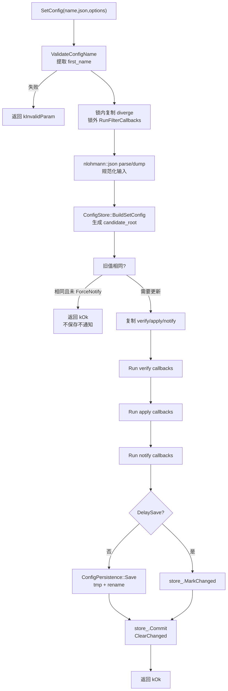
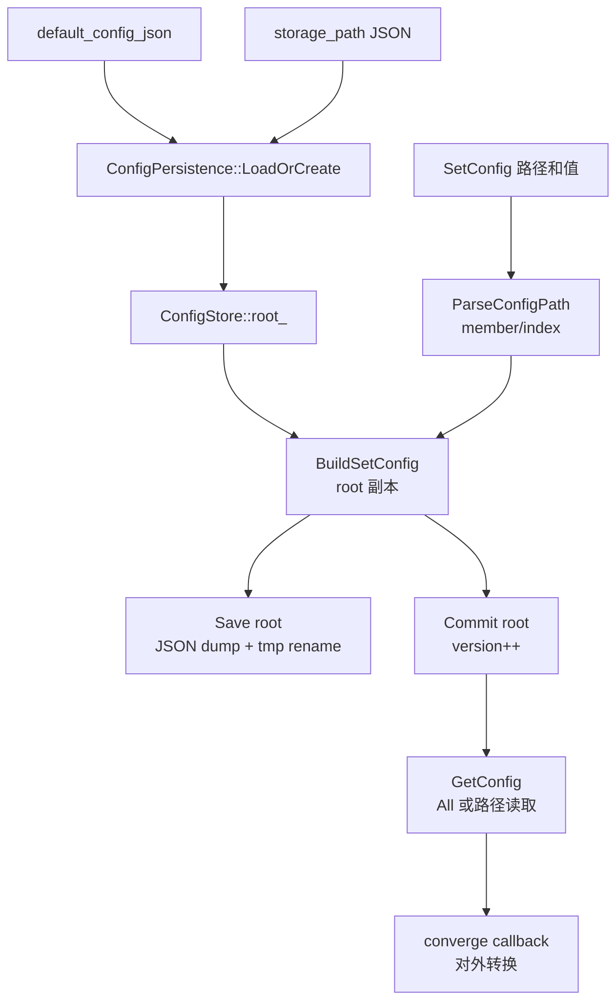

# config_service的详细设计

- 仓库根目录: `/home/cp/Public/hisi/live_stream/libs/config_service`
- 文档目标: 围绕 config_service 当前源码的配置树更新、JSON 解析、持久化、回调注册、状态时序和嵌入式资源约束展开实现级设计分析。

## 设计范围与重点

- 当前覆盖范围: `include/config_service.h` 的 public API，`src/config_service.cpp` 的 service 编排，`src/config_store.*` 的配置树读写，`src/config_persistence.*` 的文件加载保存，`src/config_signal.*` 的 callback registry，`src/config_name.cpp` 的路径解析，以及 `nlohmann::json` 作为统一 JSON 值模型。
- 当前不展开的内容: HTTP/ONVIF 请求解析、权限模型、logger_service 审计、event_service 事件对象、业务配置字段语义、升级迁移策略。
- 重点链路选择依据: 当前 public API 的核心价值在 `SetConfig()` 和 `GetConfig()`；它们决定配置修改顺序、回调边界、持久化时机和对外 JSON 视图。
- 重要源码修正: 旧文档中的 `ConfigUpdateRequest`、`DefaultConfigSchemas`、`UpdateGroupConfig`、`IConfigChangeSink`、`IConfigAuditSink` 不是当前源码的一部分，本文不再把它们写为已实现设计。

### 来自项目文档的设计输入

| 结论编号 | 文档路径 | 设计输入 | 当前源码符号 | 验证结论 | 进入的详细设计章节 |
| --- | --- | --- | --- | --- | --- |
| D1 | `/home/cp/Public/hisi/live_stream/docs/ipc_software_design.md` | config_service 是唯一配置读写入口。 | `IConfigService`, `SetConfig`, `GetConfig`, `SaveFile` | 部分确认 | 关键控制流/数据结构 |
| D2 | 同上 | 配置修改需要校验、应用、持久化、通知和审计。 | `SetConfig`, `AttachVerify`, `AttachApply`, `AttachNotify` | 部分确认，缺审计 | 关键控制流/风险 |
| D3 | 同上 | 固定 16 个默认配置组。 | `ConfigServiceOptions::default_config_json` | 源码未内置 | 风险与实现偏差 |
| D4 | 同上 | public API 使用 infra 错误模型并实现 `IService`。 | `IConfigService : infra::IService` | 确认 | 关键函数分析 |
| D5 | 同上 | 初期配置文件使用 JSON。 | `ConfigJson`, `nlohmann::json`, `ConfigPersistence` | 确认 | 关键算法分析 |

## 关键控制流

### 配置写入控制流

- 为什么是重点: `SetConfig()` 是配置中心最关键的写链路，决定配置是否先被校验和应用，再落盘或延迟保存。
- 入口: `IConfigService::SetConfig(const std::string& name, const std::string& json, int* apply_result, int apply_options)`。
- 关键步骤: 校验配置名；复制 diverge callbacks 并在锁外转换输入 JSON；解析并规范化 JSON；构建候选 root；复制 verify/apply/notify callbacks；执行回调；按 `kConfigApplyDelaySave` 决定立即保存或标记 changed；提交候选 root。
- 关键判定: `started_`、配置路径是否合法、JSON 是否可解析、旧值是否相同、`kConfigApplyForceNotify`、`kConfigApplyNoNotify`、`kConfigApplyDelaySave`、回调写入的 apply_result。
- 失败路径: 回调失败、JSON 解析失败、路径非法或文件保存失败都会返回 `infra::Status`，且不会执行最终 `store_.Commit(candidate_root)`。



图解说明: 配置更新不是后台队列；外部回调和文件保存都在锁外执行。当前实现先执行 notify，再保存，再提交内存状态，因此 notify 回调看到的是候选配置 JSON，但中心内部 root 还未 commit。

### 关键函数调用链

| 入口 | 调用序列 | 执行上下文 | 锁/等待/异步边界 | 失败出口 | 设计结论 |
| --- | --- | --- | --- | --- | --- |
| `SetConfig()` | `ValidateConfigName` -> `RunFilterCallbacks(diverge)` -> JSON parse -> `BuildSetConfig` -> `RunConfigCallbacks(verify/apply/notify)` -> optional `Save` -> `Commit` | 调用方线程，同步执行 | callback 和文件 IO 在锁外；复制 callback 表时短暂加锁 | `kInvalidParam/kBusy/kNotFound/kIoError/kInternalError` | 主链路清晰，但没有 queue、审计和 rollback。 |
| `GetConfig()` | `store_.GetConfig` -> JSON dump -> `RunFilterCallbacks(converge)` -> JSON parse/dump | 调用方线程，同步执行 | 读取 root 和复制 converge 时加锁；过滤在锁外 | `kInvalidParam/kInternalError/kNotFound` | 支持内部配置和对外配置视图分离。 |
| `Init()` | `persistence_.LoadOrCreate` -> `store_.Load` -> `initialized_=true` | 生命周期线程 | 全程持锁；无外部 callback | `kInvalidParam/kNotFound/kIoError` | 启动时要求根配置是 JSON object。 |

### 源码片段：写链路保存与提交

- 文件: `src/config_service.cpp`
- 函数/结构: `ConfigServiceImpl::SetConfig`
- 片段用途: 展示 `DelaySave`、文件保存和 commit 的顺序。
- 选择原因: 该顺序决定运行态回调、持久化文件和内存配置树之间的一致性窗口。

```cpp
if ((apply_options & kConfigApplyDelaySave) == 0) {
    infra::Status save_error = persistence_.Save(candidate_root);
    if (save_error != infra::Status::kOk) {
        *result |= kConfigApplyWriteFileError;
        return save_error;
    }
}

{
    infra::MutexGuard guard(&mutex_);
    store_.Commit(candidate_root);
    if ((apply_options & kConfigApplyDelaySave) != 0) {
        store_.MarkChanged();
    } else {
        store_.ClearChanged();
    }
}
```

- 片段分析: 非延迟保存模式先保存候选 root，保存成功后才提交内存；延迟保存模式直接提交内存并标记 changed。
- 设计结论: 普通保存失败不会污染中心 root；延迟保存能减少 flash 写入，但把持久化可靠性交给后续 `SaveFile()` 或 `Stop()`。
- 风险或优化点: apply/notify 已经在保存前执行；如果保存失败，业务回调可能已经产生运行态副作用。

## 关键数据流或关键机制流

### 配置 document 加载、读取、更新和保存机制流

- 输入来源: `ConfigServiceOptions::storage_path` 指向的 JSON 文件，或 `default_config_json`。
- 中间状态: `ConfigStore::root_` 保存完整 JSON object，`version_` 每次 commit 递增，`changed_` 标记延迟保存。
- 更新机制: `BuildSetConfig()` 用配置路径在 root 副本上创建或替换目标值，生成候选 root；成功链路最后由 `Commit()` 替换当前 root。
- 输出去向: `GetConfig()` 返回指定路径或 `All`；`Save()` 写入临时文件并 rename。



图解说明: 当前配置文件不是 `{version, groups}` 包装格式，而是直接保存完整 JSON root；版本号只存在内存中，未持久化到文件。

### 源码片段：持久化写入

- 文件: `src/config_persistence.cpp`
- 函数/结构: `ConfigPersistence::Save`
- 片段用途: 展示目录创建、临时文件和 rename 提交流程。
- 选择原因: 这是嵌入式文件系统掉电风险的关键边界。

```cpp
const infra::Status dir_error =
    infra::Path::MakeDirs(infra::Path::DirName(options_.storage_path));
if (dir_error != infra::Status::kOk) {
    return dir_error;
}

const std::string temp_path = options_.storage_path + ".tmp";
const infra::Status write_error =
    infra::File::WriteAll(temp_path, root.dump());
if (write_error != infra::Status::kOk) {
    return write_error;
}
return infra::File::Rename(temp_path, options_.storage_path);
```

- 片段分析: 写正式文件前先确保目录存在，再用临时文件替换正式文件。
- 设计结论: 该设计比直接覆盖正式文件更适合嵌入式文件系统，但仍不是掉电安全提交。
- 风险或优化点: 当前没有 fsync 文件和目录、CRC、双备份、schema version 或损坏文件回退。

## 关键状态与时序

- 生命周期: `constructed -> Init -> Start -> Stop -> Deinit`。`Init()` 后允许读，`Start()` 后允许写。
- 运行状态: `initialized_` 控制加载完成，`started_` 控制写入门禁；`ConfigStore::changed_` 控制是否需要保存延迟配置。
- 保存时序: 普通 `SetConfig` 保存成功后 commit；延迟 `SetConfig` commit 后标记 changed；`SaveFile()` 读取 root 副本并锁外保存，成功后清除 changed。
- 停止时序: `Stop()` 如果发现 changed，会在锁外调用 `SaveFile()`，但忽略返回值。
- 并发边界: callback 表在锁内复制，执行时不持锁；这降低死锁风险，但注册后没有 token 或注销同步。

## Linux 嵌入式资源与运行机制

### 内存与缓冲区生命周期

- `ConfigJson` 使用 `nlohmann::json` 表达完整 JSON 树，适合小型配置文件，不适合超大配置文档。
- `SetConfig()` 会构造候选 root 副本，换取失败不污染当前 root 的语义。
- `GetConfig("All")` 和 `Save()` 会序列化完整 root，CPU 和内存开销与配置文件大小线性相关。

### 寄存器与硬件资源

- 本库无 MMIO、寄存器、时钟、复位、GPIO、DMA 或 IRQ 资源所有权。
- 与海思媒体或网络硬件相关的参数只作为 JSON 配置值存在，真实应用由业务 callback 完成。

### 文件 / flash / 分区 / 持久化

- 持久化对象是一个 JSON object 根文档。
- `storage_path` 可放在 flash 文件系统；`kConfigApplyDelaySave` 可减少频繁写入，但增加掉电丢配置风险。
- 当前没有配置文件加密、签名、CRC、主备副本、迁移表或坏块策略。

### socket / 队列 / cgroup / 进程模型

- 本库属于控制面库，不创建 socket、进程、线程、队列或 cgroup。
- 写请求由调用方线程同步执行；没有后台串行 worker。

### 锁和并发保护

- 共享状态包括 `initialized_`、`started_`、`ConfigStore` 和 `ConfigSignalRegistry`。
- 保护原语是 `infra::Mutex` 和 `infra::MutexGuard`。
- 外部 callback 在锁外执行，避免直接死锁；但 callback 生命周期由调用方负责。

## 音视频与媒体链路专项（按需）

- 媒体 pipeline 位置: config_service 不在媒体数据面中，只提供媒体配置的控制面入口。
- 帧或码流生命周期: 不持有帧、码流、buffer、编码器句柄或发送队列。
- 码率、延迟与重配置: 相关 JSON 值需要由 media_service 注册 apply callback 后转化为实际编码器或 ISP 配置。

## 网络协议与数据通路专项（按需）

- 协议与会话模型: 本库不处理 HTTP、RTSP、ONVIF 或 WebRTC 协议。
- ingress/egress 主路径: ingress 是已解析的配置名和 JSON 字符串；egress 是 JSON 字符串、错误码和 callback 副作用。
- 安全边界: auth/http/onvif 等入口必须在调用前做权限校验；config_service 当前不感知用户身份。

## 关键函数分析

### `ConfigServiceImpl::Init`

- 作用: 加载或创建根 JSON 配置，并初始化 store。
- 调用者: service 编排层或主程序。
- 输入/输出: 使用 `ConfigServiceOptions`；成功后 `initialized_ = true`。
- 风险点: 文件存在但 JSON 损坏或根不是 object 时 Init 失败，没有备份恢复。

### `ConfigServiceImpl::SetConfig`

- 作用: 执行配置写入主链路。
- 调用者: 管理入口或业务模块。
- 输入/输出: 输入配置路径、JSON 字符串、apply result 指针和 apply options；输出 `infra::Status`。
- 全局状态影响: 成功时替换 `ConfigStore::root_`，递增内存版本，按保存模式更新 changed。
- 风险点: 回调先于持久化和 commit 执行，失败回滚只覆盖中心 root，不覆盖业务副作用。

### `ConfigServiceImpl::GetConfig`

- 作用: 读取完整 root 或指定路径配置，并可通过 converge callback 改写输出视图。
- 调用者: 管理入口或业务模块。
- 输入/输出: 输入配置名，输出规范化 JSON 字符串。
- 风险点: converge callback 输出必须仍是合法 JSON，否则返回 `kInternalError`。

### `ConfigPersistence::LoadOrCreate`

- 作用: 按 storage_path 从文件加载，缺失时按默认 JSON 创建，内存模式则直接解析默认 JSON。
- 风险点: `create_storage_if_missing=false` 且文件不存在时返回 `kNotFound`；默认 JSON 非 object 时启动失败。

### `ConfigStore::BuildSetConfig`

- 作用: 根据路径构建候选 root，支持 `All`、对象成员和数组下标。
- 风险点: 写不存在路径会自动创建中间 object/array，可能让拼错字段进入配置树。

## 关键数据结构分析

### 结构关系总览

| 结构名 | owner | 创建位置 | 主要读者 | 主要写者 | 保护方式 | 关键不变量 |
| --- | --- | --- | --- | --- | --- | --- |
| `ConfigServiceOptions` | 调用方传入，impl/persistence 复制 | `CreateConfigService` | `Init`, `Save` | 构造后不修改 | 只读 | 空 `storage_path` 表示内存模式 |
| `ConfigStore` | `ConfigServiceImpl` | impl 构造 | `GetConfig`, `SaveFile` | `Load`, `Commit`, changed 标记 | mutex | `root_` 必须是 JSON object |
| `ConfigPersistence` | `ConfigServiceImpl` | impl 构造 | `Init`, `SetConfig`, `SaveFile` | 无运行态突变 | 内部 options 只读 | 只保存 JSON object |
| `ConfigSignalRegistry` | `ConfigServiceImpl` | impl 构造 | `SetConfig`, `GetConfig` | `Attach*` | mutex | key 归一到 first-grade 配置名 |
| `ConfigJson` | store 或临时变量 | parser/store | store/persistence | JSON parse/BuildSetConfig | 调用方约束 | value 必须符合配置路径和业务约束 |

### `IConfigService`

- 结构职责: config_service 的 public interface。
- 所属模块/定义位置: `include/config_service.h`。
- 生命周期: `CreateConfigService()` 返回 `std::unique_ptr<IConfigService>`。
- 关键接口: `SetConfig`、`GetConfig`、`SaveFile`、五类 `Attach*` callback。
- 设计结论: 接口轻量且不泄漏 JSON 内部结构，但缺少 unregister、schema 和审计上下文。

### `ConfigServiceImpl`

- 结构职责: 编排生命周期、锁、store、persistence 和 signal registry。
- 所属模块/定义位置: `src/config_service.cpp`。
- 并发访问方式: public API 内部加锁；callback 和文件 IO 避免持锁执行。

#### 源码片段

- 文件: `src/config_service.cpp`
- 函数/结构: `ConfigServiceImpl` 关键字段
- 片段用途: 展示实现私有状态。
- 选择原因: 这些字段决定状态所有权、并发保护和持久化边界。

```cpp
ConfigServiceOptions options_;
ConfigPersistence persistence_;
ConfigStore store_;
ConfigSignalRegistry signals_;
infra::Mutex mutex_;
bool initialized_ = false;
bool started_ = false;
```

- 片段分析: 配置状态、文件能力和 callback registry 都由单个 service 实例拥有。
- 设计结论: 模块边界清晰，适合静态库形式集成。
- 风险或优化点: lifecycle 用两个 bool 表达，状态更多时建议改为显式 enum。

## 关键算法分析（按需）

### 机制 1：配置路径解析

- 算法类型: 小型路径语法解析。
- 入口: `ValidateConfigName`、`ParseConfigPath`、`GetFirstGradeConfigName`。
- 输入/输出: 输入如 `stream.bitrate`、`channels[0].enabled`、`All`；输出 member/index segment 列表。
- 关键规则: member 只允许字母数字、`_`、`-`；数组下标必须是非空十进制数字；`All` 是特殊根路径。
- 核心步骤拆解: 先解析首级 member；随后循环识别 `.` member 或 `[index]` segment；遇到非法字符、空 member、空下标或未闭合 `]` 时立即失败。
- 风险: 路径合法不代表字段合法，未知字段会被 `BuildSetConfig()` 创建。

### 机制 2：JSON 解析和规范化输出

- 算法类型: 基于 `nlohmann::json` 的解析和 dump。
- 入口: `ConfigJson::parse`、`ConfigJson::dump`。
- 能力: 使用第三方成熟 JSON 实现表达 object、array、string、number、bool、null。
- 核心步骤拆解: 输入字符串解析为 `ConfigJson`；配置树变更直接操作 JSON value；输出通过 `dump()` 规范化。
- 复杂度: 对输入大小近似 O(n)，递归深度取决于 JSON 嵌套深度。
- 风险: 仍需要业务侧限制最大文档大小和嵌套深度，避免恶意大配置造成内存或栈压力。

## 设计优缺点与优化计划

### 设计优点

| 编号 | 优点结论 | 源码/文档依据 | 对应设计维度 | 嵌入式价值 | 适用边界或前提 | 后续应保留的约束 |
| --- | --- | --- | --- | --- | --- | --- |
| S1 | public API 与实现分离。 | `include/config_service.h`, `CreateConfigService` | 模块边界 | 降低静态库耦合。 | 其他模块只依赖 include。 | 不暴露锁、文件句柄和 JSON 内部类型。 |
| S2 | store/persistence/signal 拆分明确。 | `ConfigStore`, `ConfigPersistence`, `ConfigSignalRegistry` | 结构分层 | 便于单独增强持久化或 callback 策略。 | 子模块边界保持稳定。 | 不把文件 IO 混入路径解析。 |
| S3 | callback 在锁外执行。 | `SetConfig`, `GetConfig` | 并发模型 | 降低跨 service 回调死锁概率。 | callback 自身线程安全。 | 继续避免持锁调用外部代码。 |
| S4 | tmp + rename 保存配置。 | `ConfigPersistence::Save` | 持久化 | 降低正式文件半写暴露风险。 | 文件系统 rename 语义可靠。 | 后续 durable write 仍保持原子替换模型。 |
| S5 | converge/diverge 支持内外配置视图转换。 | `AttachConverge`, `AttachDiverge` | 接口扩展性 | 可隔离业务内部格式和管理接口格式。 | callback 输出合法 JSON。 | 转换失败必须显式返回错误。 |

### 设计缺点

| 编号 | 缺点结论 | 涉及结构/路径/接口 | 影响范围 | 典型触发场景 | 实际影响 | 为什么属于设计问题 | 相关风险章节引用 |
| --- | --- | --- | --- | --- | --- | --- | --- |
| W1 | 没有字段级 schema 和范围校验。 | `SetConfig`, `BuildSetConfig` | 全部配置 | 拼错字段或类型错误 | 非法业务配置可进入 root。 | 配置中心无法表达业务约束。 | R1 |
| W2 | 回调无 unregister/token。 | `Attach*`, `ConfigSignalRegistry` | 业务接入 | 模块卸载或重启 callback 对象 | callback 生命周期难管理。 | 注册关系只有追加，没有所有权模型。 | R2 |
| W3 | apply/notify 先于持久化和 commit。 | `SetConfig` | 写链路一致性 | 保存失败或 callback 反向读取 | 业务副作用和中心状态可能短暂不一致。 | 缺少 prepare/commit/rollback 分阶段协议。 | R3 |
| W4 | 延迟保存和 Stop 自动保存可靠性有限。 | `kConfigApplyDelaySave`, `Stop`, `SaveFile` | flash 持久化 | 掉电或 Stop 保存失败 | 延迟配置可能丢失且错误被忽略。 | 控制面没有 durable commit 策略。 | R4 |
| W5 | JSON 输入缺少业务大小/深度限制。 | `ConfigJson` 解析入口 | 输入健壮性 | 超大或深层 JSON | 可能造成资源压力。 | JSON 能力没有与产品配置约束绑定。 | R5 |

### 优化计划

| 编号 | 阶段 | 对应缺点 | 优化方向 | 具体改动边界 | 受影响接口或结构 | 兼容性要求 | 预期收益 | 验证方式 | 优先级 |
| --- | --- | --- | --- | --- | --- | --- | --- | --- | --- |
| O1 | 短期 | W1 | 增加字段 schema 或 per-group validator。 | `SetConfig` 校验层和 callback contract | `IConfigService`, `ConfigProc` | 保持旧 `SetConfig` 可用。 | 阻止非法配置落盘。 | 字段类型、范围、未知字段单测。 | 高 |
| O2 | 短期 | W2 | 注册返回 token，并支持注销和等待在途 callback。 | `ConfigSignalRegistry` | `Attach*` 新增兼容接口 | 旧接口保留过渡。 | 消除悬空 callback 风险。 | 并发注销/回调测试。 | 高 |
| O3 | 中期 | W3 | 引入 prepare/apply/commit/rollback 或调整为保存后通知。 | `SetConfig` 主链路 | callback 语义 | 明确 notify 观察到的状态。 | 降低运行态和中心状态不一致。 | 模拟保存失败和反向读取测试。 | 高 |
| O4 | 中期 | W4 | durable write：fsync、CRC、主备文件、保存错误上报。 | `ConfigPersistence`, `Stop` | `ConfigServiceOptions` | 兼容旧 JSON 文件。 | 提升掉电恢复能力。 | 损坏文件和掉电模拟测试。 | 高 |
| O5 | 中期 | W5 | 增加 JSON 大小/深度限制。 | 配置入口和持久化加载入口 | `ConfigJson` parse/dump 调用点 | 默认限制可配置。 | 提升健壮性和资源可控性。 | 大文档、深嵌套输入测试。 | 中 |

### 缺点与优化方向映射

| 缺点 | 优化方向 | 当前处理 |
| --- | --- | --- |
| W1 | O1 | 当前只保证 JSON 语法和 root object。 |
| W2 | O2 | 当前 callback 复制后锁外执行。 |
| W3 | O3 | 当前保存失败不 commit root。 |
| W4 | O4 | 当前依赖 tmp rename 和手动 SaveFile。 |
| W5 | O5 | 当前 parser 拒绝不支持语法。 |

### 暂不优化项

| 项目 | 暂不优化原因 | 保留风险 | 重新评估条件 |
| --- | --- | --- | --- |
| 直接接入 logger_service 审计 | logger/event 公共契约尚未在本模块出现稳定依赖。 | 配置操作审计需要上层补齐。 | logger_service 提供稳定 public API 后。 |
| 内置 16 个默认配置组 | 当前源码选择从 options 注入默认 JSON，业务字段尚未统一。 | 默认配置完整性依赖上层。 | media/network/user 等业务配置字段稳定后。 |
| 后台写队列 | 当前同步 API 简单可测。 | 多入口并发写由调用方承担重试或串行。 | 出现实际多客户端配置竞争后。 |

## 风险与实现偏差

| 编号 | 类型 | 说明 | 影响 | 建议 |
| --- | --- | --- | --- | --- |
| R1 | 实现偏差 | 文档期望字段级配置管理，当前只有 JSON 树和路径级写入。 | 错误字段可能进入配置。 | 优先执行 O1。 |
| R2 | 生命周期风险 | callback registry 只追加，不返回 token，不支持注销。 | 业务对象销毁后可能仍被调用。 | 执行 O2。 |
| R3 | 一致性风险 | apply/notify 先于保存和 commit。 | 保存失败时业务副作用可能已发生。 | 执行 O3。 |
| R4 | 持久化风险 | 延迟保存掉电丢失，Stop 忽略 SaveFile 错误。 | 配置变更可能未落盘。 | 执行 O4。 |
| R5 | 健壮性风险 | JSON parser 无大小/深度限制，且不支持 `\\u` escape。 | 合法配置兼容性和恶意输入防护不足。 | 执行 O5。 |
| R6 | 文档差异 | `ipc_software_design.md` 提到审计、事件和默认组，当前源码未实现。 | 上层误以为能力已完备。 | 在接入文档和接口注释中标明当前边界。 |
